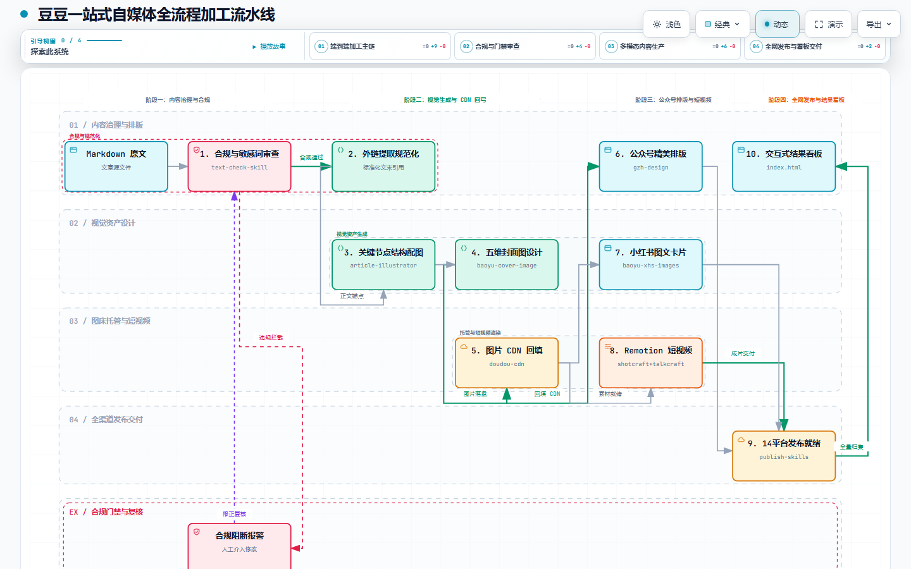
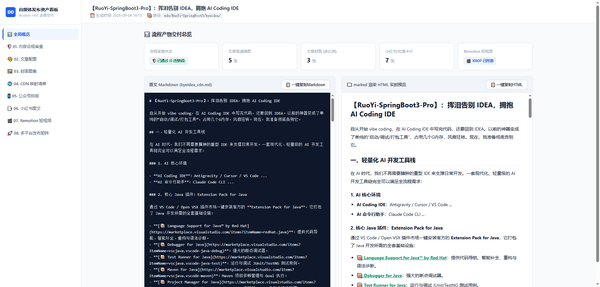
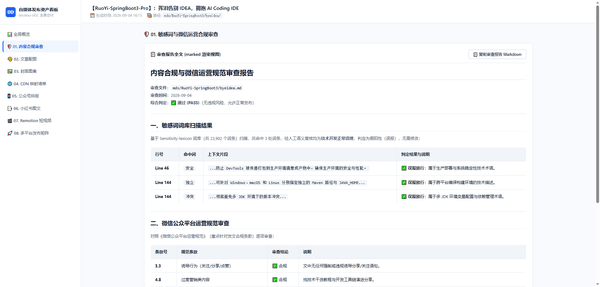
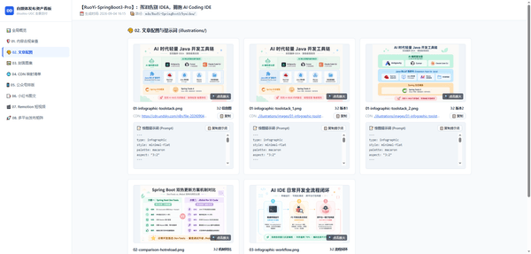
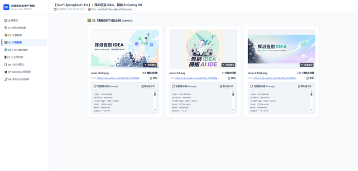
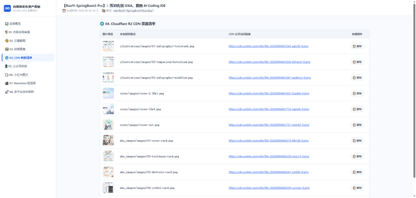
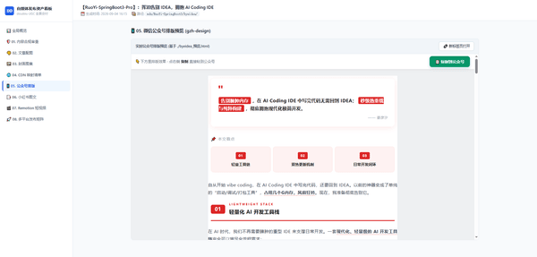
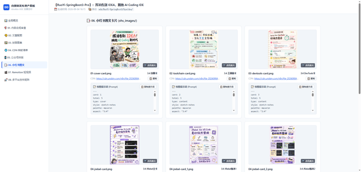
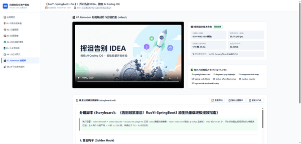
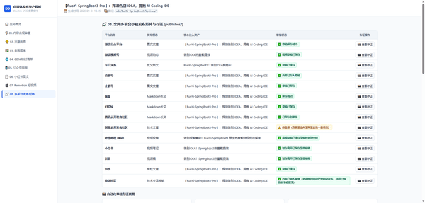

<h1 align="center">豆豆一站式自媒体内容生成与发布 skill</h1>

<p align="center">
  <b>简体中文</b> | <a href="README_EN.md">English</a>
</p>

一站式全流程依次执行**内容合规检测 → 外链标准化引用追加 → 文章高清配图生成 → 质感封面图生成 → 图片 CDN 图床上传与回写 → 微信公众号精美排版 → 小红书图文卡片生成 → Remotion 电影感短视频制作 → 全网 14 大主流平台自动化填入与发布就绪**，并在产物根目录生成**全景交互式 HTML 结果汇总看板**。

<p align="center">
  
</p>

---

## 📑 目录导航

- [🔄 全流程工序流水线](#-全流程工序流水线)
- [📖 技能使用指南](#-技能使用指南)
  - [一、安装](#一安装)
  - [二、使用](#二使用)
- [🖼️ 产物示例图](#️-产物示例图)
- [🛠️ 协同技能矩阵](#️-协同技能矩阵)
- [💬 交流与支持](#-交流与支持)
- [📄 许可证](#-许可证)

---

## 🔄 全流程工序流水线

<p align="center">
  <a href="./assets/doudou-ugc-workflow.html" title="点击查看可交互全景流程图">
    
  </a>
</p>

---

## 📖 技能使用指南

本技能库作为 **AI Agent 的自媒体全流程自动化生产专家**（支持 Antigravity、Claude Code、OpenCode 等平台）。

---

### 一、安装

在任何目标工程根目录下，通过命令行一键安装：

```bash
npx skills add undsky/doudou-UGC-skill --yes
```

---

### 二、使用

直接调用指令 + Markdown 文章即可开启生产线：

```text
/doudou-UGC articles/my-post.md
```

---

## 🖼️ 产物示例图

|                                      产物示例                                       |                                   产物示例                                    |
| :---------------------------------------------------------------------------------: | :---------------------------------------------------------------------------: |
|     **全景交互式结果汇总看板**<br><br>     |      **01. 内容合规审查报告**<br><br>      |
|         **02. 文章配图与提示词**<br><br>         |      **03. 封面设计与提示词**<br><br>      |
|         **04. CDN 资源映射清单**<br><br>         |    **05. 微信公众号排版效果**<br><br>    |
|        **06. 小红书/微信图文卡片**<br><br>         | **07. Remotion 短视频与分镜**<br><br> |
| **08. 全网多平台自动化发布矩阵**<br><br> |                                                                               |

---

## 🛠️ 协同技能矩阵

本技能库作为管线调度中枢，协同联动以下自媒体专项技能：

| 工序环节           | 协同技能 / 工具                                                                                                                                                                                                                                           | 职责与产物说明                                                          |
| :----------------- | :-------------------------------------------------------------------------------------------------------------------------------------------------------------------------------------------------------------------------------------------------------- | :---------------------------------------------------------------------- |
| **01. 合规审查**   | [`text-check-skill`](https://github.com/undsky/text-check-skill)                                                                                                                                                                                          | 敏感词扫描与《微信公众平台运营规范》核查                                |
| **02. 引用规整**   | 标准化外链追加规则                                                                                                                                                                                                                                        | 提取正文裸外链去重排序，追加标准引用链接                                |
| **03. 文章配图**   | [`baoyu-article-illustrator`](https://github.com/JimLiu/baoyu-skills/tree/main/skills/baoyu-article-illustrator)                                                                                                                                          | 分析文章信息密度，生成信息图、流程图、架构图等关键节点高清插画          |
| **04. 封面设计**   | [`baoyu-cover-image`](https://github.com/JimLiu/baoyu-skills/tree/main/skills/baoyu-cover-image)                                                                                                                                                          | 定制提示词，生成多比例封面                                              |
| **05. CDN 加速**   | [`doudou-cdn`](https://github.com/undsky/doudou-cdn-skill)                                                                                                                                                                                                | 批量上传图片至图床（API / GitHub / R2）                                 |
| **06. 公众号排版** | [`gzh-design`](https://github.com/undsky/gzh-design-skill)                                                                                                                                                                                                | 精美主题组件装配，输出纯排版正文与预览页                                |
| **07. 图文卡片**   | [`baoyu-xhs-images`](https://github.com/JimLiu/baoyu-skills/tree/main/skills/baoyu-xhs-images)                                                                                                                                                            | “痛点—成因—拆解—解决方案”四层模型，解构竖版卡片                         |
| **08. 短视频制作** | [`Remotion`](https://github.com/remotion-dev/remotion) + [`shotcraft`](https://github.com/Vincentwei1021/video-shotcraft) + [`talkcraft`](https://github.com/Vincentwei1021/video-talkcraft) + [`doudou-tts`](https://github.com/undsky/doudou-tts-skill) | 黄金钩子开场 + 镜头动效卡 + edge-tts 高清配音字幕 + Remotion 终渲染成片 |
| **09. 多平台发布** | [`doudou-publish-skills`](https://github.com/undsky/doudou-publish-skills)                                                                                                                                                                                | 模拟真实人机行为防风控，自动填入微信、头条、B站、小红书、抖音等草稿箱   |
| **10. 汇总看板**   | `render_dashboard.mjs`                                                                                                                                                                                                                                    | 一键生成包含全流程资产预览、播放器与多平台状态仪表盘                    |

---

## 💬 交流与支持

| 公众号                                       | QQ群                                          |
| -------------------------------------------- | --------------------------------------------- |
|  |  |

---

## 📄 许可证

本项目采用 [CC BY-NC 4.0](LICENSE) 许可证。

- 个人使用、学习、研究与非商业项目可以直接使用。
- 公开发布衍生作品时，请注明来源。
- 商业用途需要单独授权，请联系作者。
