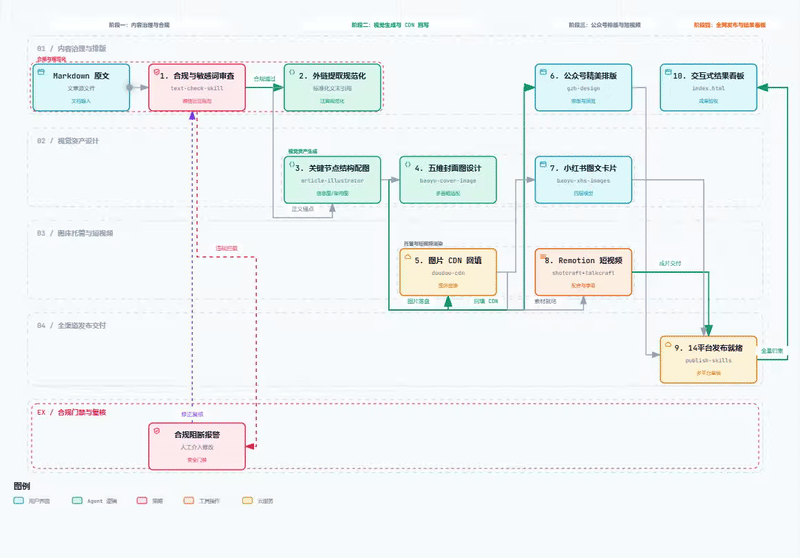
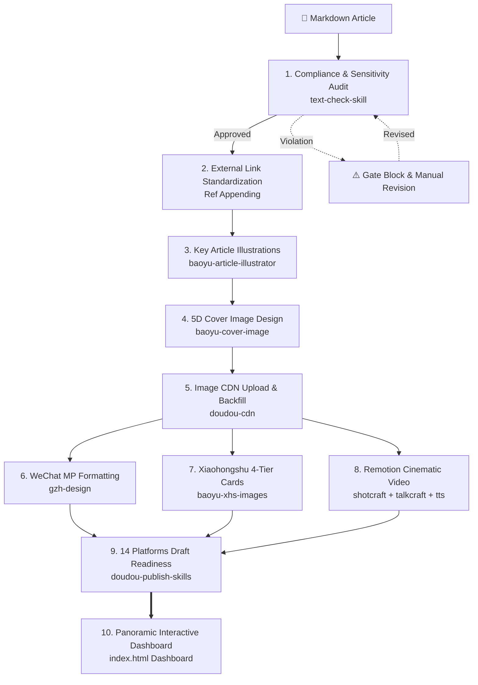

<h1 align="center">Doudou All-in-One UGC Content Generation & Publishing Skill</h1>

<p align="center">
  <a href="README.md">简体中文</a> | <b>English</b>
</p>

An all-in-one UGC content automation pipeline skill library for local Markdown articles. Automatically executes **content compliance screening → external link standard referencing → article illustration generation → 5D cover design → image CDN upload & backfilling → WeChat official account formatting → Xiaohongshu 4-tier infographic cards → Remotion cinematic short video creation → automated publishing readiness across 14 mainstream media platforms**, while generating a **panoramic interactive HTML result dashboard** in the output directory.

<p align="center">
  
</p>

---

## 📑 Table of Contents

- [✨ Key Features](#-key-features)
- [🔄 End-to-End Pipeline Workflow](#-end-to-end-pipeline-workflow)
- [📖 User Guide](#-user-guide)
  - [1. Installation](#1-installation)
  - [2. Usage](#2-usage)
- [🖼️ Generated Asset Showcase](#️-generated-asset-showcase)
- [🛠️ Coordinated Skills Matrix](#️-coordinated-skills-matrix)
- [💬 Community & Support](#-community--support)
- [📄 License](#-license)

---

## ✨ Key Features

- **🚀 End-to-End Automation Pipeline**: Driven by a single local Markdown document, seamlessly coordinating 10 distinct phases without tedious manual switching between tools.
- **🛡️ Strict Compliance & Standard Referencing**: Built-in sensitive word filtering and WeChat Official Accounts Operations Specification checks, automatically extracting all external links to append standardized references.
- **🎨 High-Quality Visual Assets**: Article structured illustrations (infographics/frameworks/flowcharts) and 5-dimensional tailored cover images (2.35:1 / 16:9 / 1:1), paired with Xiaohongshu 4-tier ("Pain Point — Root Cause — Breakdown — Solution") infographic card series.
- **🎬 Remotion Cinematic Short Videos**: Golden Hook opening principles, dynamically selecting shot recipe cards from `video-shotcraft` and `video-talkcraft`, unified with `edge-tts` voiceover and character-aligned SRT subtitles to render production-grade MP4 videos.
- **🌐 14 Mainstream Media Platforms Ready**: Full coverage for WeChat MP / Pin, WeChat Channels, Toutiao, Baijiahao, Penguin (QQ OM), Juejin, CSDN, Tencent Cloud, Aliyun, Bilibili, Xiaohongshu, Douyin, Zhihu, and LinuxSB.
- **📊 Panoramic Interactive Dashboard**: Automatically outputs a standalone interactive `index.html` dashboard in the asset root directory, complete with embedded video players, illustration galleries, and multi-platform publishing status.

---

## 🔄 End-to-End Pipeline Workflow

<p align="center">
  <a href="./assets/doudou-ugc-workflow.html" title="Click to open interactive panoramic workflow">
    
  </a>
</p>

> 💡 **Interactive Diagram**: Open **[assets/doudou-ugc-workflow.html](./assets/doudou-ugc-workflow.html)** directly in your browser to experience animated trace execution, multi-chapter view modes, and light/dark theme switching.

<details>
<summary><b>📋 View Mermaid Topology</b></summary>



</details>

---

## 📖 User Guide

This skill library serves as an **automated UGC media production expert for AI Agents** (compatible with Antigravity, Claude Code, OpenCode, etc.).

---

### 1. Installation

Install into any target project root via the command line:

```bash
npx skills add undsky/doudou-UGC-skill --yes
```

---

### 2. Usage

Simply instruct the AI in natural language to process your Markdown article:

```text
Process mds/AICoding/deepseek-guide.md through the full UGC pipeline and generate the dashboard
```

Or prepare full-platform publication readiness:

```text
Generate full UGC production assets and ready drafts across all platforms for articles/my-post.md
```

---

## 🖼️ Generated Asset Showcase

| Asset Showcase | Asset Showcase |
| :---: | :---: |
| **Panoramic Interactive HTML Dashboard**<br><br> | **01. Compliance & Sensitivity Audit Report**<br><br> |
| **02. Article Illustrations & Prompts**<br><br> | **03. Tailored Cover Design Gallery**<br><br> |
| **04. CDN Asset Manifest & URL Mapping**<br><br> | **05. WeChat Formatting Preview**<br><br> |
| **06. Xiaohongshu Infographic Cards**<br><br> | **07. Remotion Short Video & Storyboard**<br><br> |
| **08. Multi-Platform Publishing Matrix**<br><br> | |

---

## 🛠️ Coordinated Skills Matrix

Serving as the central pipeline orchestrator, this skill coordinates the following specialized agents:

| Stage | Coordinated Skill / Tool | Role & Asset Output |
| :--- | :--- | :--- |
| **01. Compliance Audit** | [`text-check-skill`](https://github.com/undsky/text-check-skill) | Sensitive word scanning & WeChat Official Accounts Operations Specification checks |
| **02. Reference Standard** | Standardization Rule | Deduplicates naked external URLs, appends standard references |
| **03. Article Illustrations** | [`baoyu-article-illustrator`](https://github.com/JimLiu/baoyu-skills/tree/main/skills/baoyu-article-illustrator) | Analyzes article info density, generates high-res infographics, flowcharts, and architecture diagrams at key nodes |
| **04. Cover Design** | [`baoyu-cover-image`](https://github.com/JimLiu/baoyu-skills/tree/main/skills/baoyu-cover-image) | Tailored prompts, generates multi-aspect ratio covers |
| **05. CDN Acceleration** | [`doudou-cdn`](https://github.com/undsky/doudou-cdn-skill) | Batch uploads images to image hosting (API / GitHub / R2) |
| **06. WeChat Formatting** | [`gzh-design`](https://github.com/undsky/gzh-design-skill) | Themed component assembly, outputs clean snippet and preview page |
| **07. Infographic Cards** | [`baoyu-xhs-images`](https://github.com/JimLiu/baoyu-skills/tree/main/skills/baoyu-xhs-images) | "Pain Point — Root Cause — Breakdown — Solution" 4-tier model, deconstructs vertical cards |
| **08. Video Production** | [`Remotion`](https://github.com/remotion-dev/remotion) + [`shotcraft`](https://github.com/Vincentwei1021/video-shotcraft) + [`talkcraft`](https://github.com/Vincentwei1021/video-talkcraft) + [`doudou-tts`](https://github.com/undsky/doudou-tts-skill) | Golden hook intro + dynamic shot recipes + edge-tts voiceover & SRT + Remotion final render |
| **09. Multi-Platform Publish** | [`doudou-publish-skills`](https://github.com/undsky/doudou-publish-skills) | Realistic human simulation and anti-bot protocols, populates drafts across 14 platforms |
| **10. Results Dashboard** | `render_dashboard.mjs` | One-click generation of dashboard with full-pipeline asset preview, players, and multi-platform status |

---

## 💬 Community & Support

| WeChat Official Account | QQ Group |
| :---------------------- | :------- |
|  |  |

---

## 📄 License

This project is licensed under the [CC BY-NC 4.0](LICENSE) License.

- Free for personal, educational, research, and non-commercial usage.
- Derivative works must include appropriate attribution.
- Commercial usage requires dedicated authorization; please contact the author.
