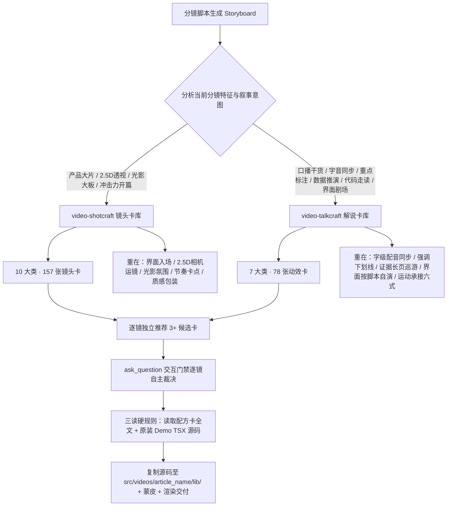

# 🎬 镜头与动效配方卡全景总览与选型矩阵 (Videocraft Catalog & Matrix)

> 本知识库深度汇总并整合了 **`video-shotcraft`（10 大类、157 张镜头配方卡）** 与 **`video-talkcraft`（7 大类、78 张解说动效卡）**，共计 **17 个专业类别、235 张镜头与动效配方卡、250+ 动效样式/变体**。
>
> 专供 `doudou-UGC` 在短视频生成步骤中（见 `SKILL.md` 阶段 8），针对分镜脚本（如 S1 黄金钩子、S2 痛点直击、S3 方案拆解、S4 实机/代码走读、S5 数据指标、S6 品牌收束等）进行**精细化逐镜筛选、智能推荐、交互门禁裁决与 Remotion 源码级组装**。

---

## 目录

- [一、两大动效引擎的分工与心智模型](#一两大动效引擎的分工与心智模型)
- [二、分镜叙事阶段与场景快速选型速查矩阵](#二分镜叙事阶段与场景快速选型速查矩阵)
- [三、video-shotcraft 镜头配方卡全集（10 大类 · 共 157 张卡）](#三video-shotcraft-镜头配方卡全集10-大类--共-157-张卡)
  - [1. 开场 / 亮相 (Opening) —— 11 张](#1-开场--亮相-opening--共-11-张卡)
  - [2. 界面入场 / 布局呈现 (UI Entrance) —— 28 张](#2-界面入场--布局呈现-ui-entrance--共-28-张卡)
  - [3. 交互演示 / 功能操作 (Interaction) —— 15 张](#3-交互演示--功能操作-interaction--共-15-张卡)
  - [4. 数据可视化 / 状态叙事 (Data) —— 13 张](#4-数据可视化--状态叙事-data--共-13-张卡)
  - [5. 相机运镜 / 空间透视 (Camera) —— 10 张](#5-相机运镜--空间透视-camera--共-10-张卡)
  - [6. 文字动画 / 标题排版 (Typography) —— 26 张](#6-文字动画--标题排版-typography--共-26-张卡)
  - [7. 节奏卡点 / 剪辑语法 (Rhythm) —— 11 张](#7-节奏卡点--剪辑语法-rhythm--共-11-张卡)
  - [8. 光影动效 / 质感增强 (Effects) —— 17 张](#8-光影动效--质感增强-effects--共-17-张卡)
  - [9. 转场接力 / 场景切换 (Transition) —— 19 张](#9-转场接力--场景切换-transition--共-19-张卡)
  - [10. 尾声收束 / 品牌定格 (Outro) —— 7 张](#10-尾声收束--品牌定格-outro--共-7-张卡)
- [四、video-talkcraft 口播解说配方卡全集（7 大类 · 共 78 张卡）](#四video-talkcraft-口播解说配方卡全集7-大类--共-78-张卡)
  - [1. 字幕花字 (Typography) —— 15 张](#1-字幕花字-typography--共-15-张卡)
  - [2. 强调标注 (Emphasis & Annotation) —— 11 张](#2-强调标注-emphasis--annotation--共-11-张卡)
  - [3. 数据信息图 (Data & Infographics) —— 11 张](#3-数据信息图-data--infographics--共-11-张卡)
  - [4. 素材呈现与界面剧场 (Media Presentation & UI Theater) —— 14 张](#4-素材呈现与界面剧场-media-presentation--ui-theater--共-14-张卡)
  - [5. 转场结构与运动承接六式 (Transition & Structure) —— 12 张](#5-转场结构与运动承接六式-transition--structure--共-12-张卡)
  - [6. 人物互动与社会证明 (Host & Social Proof) —— 7 张](#6-人物互动与社会证明-host--social-proof--共-7-张卡)
  - [7. 运镜系统 (Camera & Cinematography) —— 8 张](#7-运镜系统-camera--cinematography--共-8-张卡)
- [五、Remotion 落地实现与组件复用指引](#五remotion-落地实现与组件复用指引)

---

## 一、两大动效引擎的分工与心智模型

`doudou-UGC` 在生成短视频时，将文章拆解为一系列连贯的分镜（Storyboards）。根据镜头的叙事重心，精准路由并挑选两大引擎中的配方卡：

---

## 二、分镜叙事阶段与场景快速选型速查矩阵

针对常见的 8 类短视频分镜形态，推荐首选与备选的组合方案：

| 分镜叙事阶段 / 功能场景 | 视觉特征与叙事能量 | 推荐首选卡片（video-shotcraft） | 推荐首选卡片（video-talkcraft） | 备选组合与备用策略 |
|---|---|---|---|---|
| **S1. 黄金钩子 / 痛点直击 (0~5s)** | 冲击力极高、迅速抓住眼球、制造悬念或危机感 | `spotlight-hero-card`, `brand-ink-open`, `fracture`, `crane-rise-reveal`, `cel-flash-stomp` | `impact-open-title`, `count-badge-title`, `motion-blur-slam-in`, `color-slam-beat-card` | `speed-slab-title`, `magician-card-flourish`, `text-as-mask` |
| **S2. 概念引入 / 痛点展开** | 结构清晰、专业感强、强调问题或关键词 | `brace-expand`, `blur-slide`, `element-body-moves`, `marker-underline-title` | `keyword-pop-highlight`, `slab-punch-title`, `strike-and-replace`, `quote-bracket-pull` | `quote-card`, `highlighter-sweep`, `scribble-annotation` |
| **S3. 架构总览 / 原理拆解** | 多节点聚合、拓扑连线、分步堆叠或折叠展开 | `bezier-source-converge-merge`, `integration-hub-map`, `card-stack`, `product-card-progressive-assemble` | `step-timeline-vertical`, `numbered-step-stack`, `line-by-line-slide`, `pencil-sketch-draw` | `paper-craft-moves`, `radial-wave`, `carousel-3d` |
| **S4. 实机演示 / 终端代码走读** | 真实感、命令行因果链、代码逐行高亮、界面自演 | `typing-code-block`, `terminal-3d`, `cursor-flyover`, `type-and-filter` | `claude-code`, `glass-code-walk`, `cursor-locked-zoom`, `terminal-typing-log`, `ui-flow-theater` | `chat-gpt`, `chat-message-flow`, `cursor-actor-demo` |
| **S5. 数据对比 / 指标大板** | 数字冲击、柱状增长、前后对比、里程碑庆祝 | `before-after-slider-scrub`, `counter-confetti`, `odometer-digit-roll`, `chart-live-moves` | `number-counter`, `chart-grow`, `bar-chart-growth`, `metric-with-sparkline`, `number-slab-pop` | `gauge-readout-moves`, `particle-celebrate-hits`, `line-chart-story-draw` |
| **S6. 证据呈现 / 长图文献巡游** | 权威性、长图滚屏、局部对焦、引文高亮 | `scanline-annotate-focus`, `research-card-stack-scroll`, `scan-bracket-sweep` | `evidence-scroll-tour`, `news-card-desk`, `stage-keyframe-tour`, `magnifier-detail`, `focus-dim-spotlight` | `media-pop-in`, `pip-zoom-box`, `sway-parallax` |
| **S7. 段间转场 / 动量接力** | 呼吸节奏切分、无缝衔接、避免黑屏或静止 | `push-through-transition`, `overexpose-flip-transition`, `whip-pan-transition`, `page-turn-transitions` | `caret-wipe-transition`, `shape-wipe-transition`, `chapter-title-card`, `chapter-progress-list` | `black-slam-transition` (限1次), `particle-weld-transition`, `bubble-swarm-takeover` |
| **S8. 品牌定格 / 尾声号召 (Outro)** | 沉淀记忆、引导点赞关注、彩蛋收尾 | `logo-shrink-wordmark-lockup`, `neon-triple-marquee`, `outro-group-photo-launch`, `grain-dissolve` | `logo-enter`, `subscribe-cta`, `x-follow-card`, `danmu-bubble-praise` | `ui-strip-away-outro`, `edit-hook-moves`, `lower-third-nameplate` |

---

## 三、video-shotcraft 镜头配方卡全集（10 大类 · 共 157 张卡）

- 🖼️ **在线画廊 (Gallery)**：[https://vincentwei1021.github.io/video-shotcraft/](https://vincentwei1021.github.io/video-shotcraft/)
- 📁 **本地技术卡片**：`.agents/skills/video-shotcraft/references/shots/`
- 💻 **本地 Remotion 源码**：`.agents/skills/video-shotcraft/demos/`

### 1. 开场 / 亮相 (Opening) —— 共 11 张卡

> **类别说明**：品牌先导、黄金钩子、大俯冲或粒子破局

| 序号 | 镜头卡标识 (`card_name`) | 变体/样式数 | 核心动效与动作语法 | 建议时长 | 能量等级 | 典型适用场景 |
|---|---|---|---|---|---|---|
| 1 | `brand-ink-open` | 1 个 | 墨线十字准星描画→字标逐字压印→打字机副标→满一秒静止再上浮消散 | 约 2.8s（83f） | 低（起步位，为后续镜头留爬升空间） | 品牌开场；任何"先立名号再进产品"的片头 |
| 2 | `crane-rise-reveal` | 1 个 | 升降臂拉升揭示——开场怼在一行数据特写，相机沿 Y 轴减速升起后拉，行行涌入直到整面 dashboard 铺满全幅 | 5s（特写 hold 20f + 拉升 100f + 满幅静止 30f） | 中高（持续单向运动，无冲击拍） | "从细节到全局"的开场定场；与 drone-dive-landing（全局→单点俯冲）互为反向 |
| 3 | `dataviz-landscape-open` | 1 个 | 暗场支流线束地景开场——多条流线汇入主干、虚构 ID 标签浮在线上、相机重景深低速飞越 | 5–8s（开场氛围段，一支片 ≤1 次） | 低开缓升（起步位，为后续爬升留空间） | 品牌级抽象开场（"数据宇宙"隐喻），接亮场产品段或字标；与 glow-flyline-moves 分工：那卡是段落内卡片之间的连线叙事，本卡是开场专用的全画幅地景 |
| 4 | `fracture` | 1 个 | 5×5 瓦片从 3D 碎片态按中心波纹逐圈聚合成整面海报，停一拍亮字，随后全部碎片背离中心加速旋转飞出画面 | 约 5.2s（156f@30fps；聚合 0–2.6s · hold 1s · 飞散 1.5s） | 高（两头高能、中段静止，适合压 BGM 重音起收） | 开场第一镜"从混沌到成形"的品牌/海报揭示；倒放或只取后半可作硬转场 |
| 5 | `icon-field-colorize` | 1 个 | 灰阶小图标点阵错峰浮现铺满全屏，停一拍后多道品牌色横带波纹极快向下扫翻全场——"功能全景先摆满，品牌一瞬间点亮"的开场/收束卡 | 浮现 ~45f 错峰 + 静置 ~10f + 翻色 12–45f + 终态静置；全段 3–4s | 中（浮现是铺垫，翻色瞬间是唯一爆点） | 开场铺陈产品能力面（图标=功能宇宙）再一举打上品牌色；功能集合页、生态/集成规模展示、片头 logo 前垫场 |
| 6 | `letterspace-materialize` | 1 个 | 大字距字标全字符并行连续描画结晶——所有字母同帧起笔、笔画像手写一样连续生长、同帧齐收成词；氛围底景上的品牌字标显影 | 静置 ~15f + 描画 ~50f + 终态静置 ≥30f；全段 3–4s | 低（静谧仪式感，一次呼吸完成） | 片尾/片头品牌字标登场（SUPERHUMAN 式大字距全大写）；章节题字；needs 静谧/高级感的收束帧 |
| 7 | `magician-card-flourish` | 1 个 | 纯黑场上蓝色星芒闪现 0.3s（X 形针状光束旋转 90°+中心辉光放射小光芒），卡片从闪光点弹射而出——极速自旋弧线飞向镜头、自旋随靠近衰减、瞬间硬定格近满幅、定格后 sheen 扫光 | 闪光 0.3s + 飞行 ~1.7s + 定格展示+扫光 ~2s；全段 4.2s | 高（一次性爆点，定格后即静） | 单张卡片/海报/封面的魔术性登场（片头主视觉、产品卡揭晓）；纯黑暗场；需要"变出来"仪式感的爆点 |
| 8 | `orbit-ring-title-open` | 1 个 | 八张 16:9 内容卡按 45° 均布在 700×375 椭圆上匀速公转（卡身永不倾斜，纵深只由 sin θ 给出 ±9% 缩放与 z 序），环撑开期间卡内容冻结首帧、f24 之后八张一起开播；居中标题逐字解糊下沉落定，关键词到位那一刻黄色马克块自左横扫铺满，mono 副行随后浮出，末段整行失焦淡出、环继续转着交棒下一镜 | 约 4.3s（130f@30fps；标题落定 f50 到退场 f108 之间是 1.9s 稳态巡回） | 中（唯一的持续运动是匀速公转，全片只有马克块横扫一次冲击） | 开场第一镜 = 「这个产品有一整套东西」；素材库/模板库/功能矩阵/案例集的门面拍；需要用真实运动的产品画面托住一句主张，而不是把截图摆成静态九宫格 |
| 9 | `spotlight-hero-card` | 1 个 | 聚光灯扫过页面锁定一张卡，斜 45° 推进后卡片弹起悬浮、光束沿轮廓两圈、贴回原位 | 约 4.6s（82–220f） | 中（质感最高的一镜，节奏慢而稳） | "单一主角"式产品开场；把一个核心对象（卡片/条目/模块）立成全片主角 |
| 10 | `stroke-segment-build` | 1 个 | 断笔成字——标题拆成十几段互不相连的笔画乱序逐段点亮，前 70% 不可读，末段落位瞬间语义"啪"地成立 | 4–5s | 低起中收（悬念型，落位帧是能量点） | 开场吊悬念的产品名/大数字揭晓；一支片 ≤1 次；与 type-assembly/draw-svg-trace 分工：那些是"看着字被组装/描画"，本卡是"意义延迟揭晓" |
| 11 | `text-as-mask` | 1 个 | 文字视频遮罩——超粗大标题字内部透出缓慢平移的产品画面，结尾字形放大 26 倍溢出、内部画面接管全屏 | 5s（hold 20f + 字内漂移 80f + 放大接管 30f + 静止 20f） | 中高（漂移段沉稳，接管段一次爆发） | 品牌词/口号与产品画面二合一的开场或章节卡；字是门、产品在门里 |

---

### 2. 界面入场 / 布局呈现 (UI Entrance) —— 共 28 张卡

> **类别说明**：组件入场、卡片堆叠、扇面展开、SVG 描摹与瀑布流

| 序号 | 镜头卡标识 (`card_name`) | 变体/样式数 | 核心动效与动作语法 | 建议时长 | 能量等级 | 典型适用场景 |
|---|---|---|---|---|---|---|
| 1 | `avatar-bracket-carousel` | 1 个 | "Your ___ teammates" 填空排版，四角对焦框钉在句中不动，头像队列在框内垂直 spring 轮换三次，入框放大清晰、出框按距离缩小淡化模糊，角色标签同步更换，切换瞬间对焦框呼吸 7% | 约 5.2s（156f@30fps） | 中（三次等距切换构成稳定节拍器，对焦框脉冲是唯一装饰性动作） | "一个位置，多种角色"的能力枚举；团队/身份/预设/人格类产品的核心一句话镜头 |
| 2 | `bezier-source-converge-merge` | 1 个 | 左侧四个来源节点各有一条细贝塞尔曲线连向右侧同一汇聚点，曲线先错峰由左向右 draw-on，节点沿自己的曲线滑向汇聚点并三段式加速缩小到消失，强调色数据包全程沿路径滑行，吞并完成后曲线从左端反向擦除只留圆形徽标 | 约 5.6s（168f@30fps） | 中（长镜慢速推进，靠数据包滑行维持活性；吞并瞬间是唯一小高点） | "多源整合/统一接入/数据汇聚"的核心机制镜头；集成、聚合、单一入口类产品的说明段落 |
| 3 | `card-stack` | 1 个 | 8 张卡从屏幕下方逐张 spring 弹入叠成一摞，全员落位后整摞一次性展成 3D 扇面——每张按序号偏转 8°、横移 34px、向后退一层 z | 约 4.2s（126f@30fps） | 中高（入场是连续小爆发，展开段收成一次平滑的整体动作） | 需要交代"我们有一组东西"的产品段落；卡片墙/模板库/方案列表的建立镜头，也能当 logo 前的一拍蓄势 |
| 4 | `carousel-3d` | 1 个 | 8 张卡按 sin/cos 排成半径 190px 的圆环并匀速整环自转一圈，每卡只绕 Y 公转、自身 billboard 朝外，正反两层同向贴图配 backface-visibility:hidden 保证任何时刻都正立不倒置，相机全程钉在浅俯角近景 | 约 5.6s（168f@30fps） | 中（匀速无变化，是可无限循环的稳态运动） | 作品集/模板库/集成清单的循环展示；需要无缝 loop 的背景拍或落地页 hero |
| 5 | `cloner-depth-echo` | 1 个 | 克隆纵队——主卡瞬间"复印"出 7 个半透明分身沿斜向纵深排开成队，停一拍后全体加速吸回本体合一+弹跳 | 4–5s | 中（陈列-收束型） | "多副本/多租户/规模感/批量处理"卖点；一镜讲完"一个=很多" |
| 6 | `deck-deal-flyin` | 1 个 | 暗场金属背景里的实体牌堆特写环绕开局，拉远交给页面后一摞卡像发牌一样硬加速甩进网格，相机追着滚动、满板停半秒 | 约 2.6s 发牌段（36–113f），前接约 2s（62f）牌堆特写可选 | 高（节奏爬升段主力，不放开场第一镜） | 展示"内容量大/源源不断汇入"的列表页与卡片墙；建立信息密度的第一印象 |
| 7 | `doc-park-left-pill-deal` | 1 个 | 文档不淡出而是向左滑出只露约 35% 宽并微缩到 0.92，右侧按旁白节奏慢速发牌三张白底描边药丸（outBack 弹入），每张落定后其下方字幕逐词加深、下一张到来前整句淡出，左侧文档全程极缓慢自动滚动保持"正在被读" | 约 5.8s（174f@30fps） | 低（慢发牌节奏，全片无峰值；靠自动滚动维持活性） | 旁白驱动的"分析结论逐条给出"段落；文档理解、推荐理由、审阅意见类产品的核心说明镜头 |
| 8 | `draw-svg-trace` | 1 个 | 描边生长圈注——一条带笔头的墨线沿元素轮廓跑一圈把它"画"出来，闭合瞬间闪黑交棒、内容淡入；同套路可给标题画下划线 | 描边 40f + 闪黑交棒 16f + hold ≥35f，约 3–4s | 中 | 单个卡片/图表/标题的被点名入场；元素级手法（整页级蓝图描线归 wall-reveal-moves C 式） |
| 9 | `element-body-moves` | 1 个 | 元素身体感两式——axial-stretch 轴向拉伸糖稀拉丝、contact-shadow-lift 接触阴影离面抬升 | A ~4.7s / B ~5.3s | A 中高 / B 低中 | 给"位置在变"之外补"身体在变"：高速飞入给速度肉身（A）、卡片点名给悬浮证据（B）；A 配横冲入场，B 配 2.5D 运镜与逐张点名 |
| 10 | `floating-glossy-label-pills` | 1 个 | 四块浅灰 dashboard wireframe 面板各顶一枚高光胶囊标签横向排队，轨道三拍向右换位（缓起→中段冲→缓收，首拍更慢带长尾），居中者放大清晰、两侧缩到 0.62 并下沉变淡微模糊形成走廊感，末段黑色描白边光标从右上斜滑到末位胶囊右端静止 | 约 4.0s（120f@30fps） | 中（三拍换位构成节拍，无爆点；光标是收尾的注意力交接） | 多功能横向枚举（Feature A–D 各一屏）；产品概览、功能巡览类段落，也可作落地页 hero 的循环底 |
| 11 | `integration-hub-map` | 1 个 | 旧页面一次性快翻 180°（侧棱瞬间亮闪）落成新中枢页，五个集成 app 图标同帧弹现、随即五条彩虹光管同帧齐连，光管内输送脉冲持续流动——"翻开新一页，生态一齐接入" | 前摇 ~0.5s + 快翻 ~1.2s + 图标齐现 → 光管齐连两拍 ~0.7s + 输送呼吸 ≥1.5s；全段 4.5–5s | 中高（翻面是爆点，输送段是余韵） | 集成/生态能力段（一个产品连一切）；版本翻新叙事（旧页翻成新页）；暗场霓虹调性的功能高潮 |
| 12 | `list-reveal` | 1 个 | 垂直菜单 6 项按 0.09 的间隔依次 scale 找位、outBack 轻微过冲落定，同时整个列表容器全程线性上移 32px——逐项入场与整体漂移是两层不相干的运动 | 约 3.6s（108f@30fps） | 低（稳定节拍，无峰值；靠漂移维持画面不死） | 导航/侧边栏/设置面板的入场；任何"界面自己长出来"的 UI 段落，也适合做旁白铺垫时的低能量底 |
| 13 | `list-stack-press` | 1 个 | 列表卡从画面底部逐张飞上摞起，每张落地压弹整摞、计数器同步跳一格 | 约 3s（18–88f） | 中 | feed/雷达/收件箱类"每天有新东西"的镜头；强调持续积累的资产列表 |
| 14 | `morph-from-primitive` | 1 个 | 原型变形——正圆呼吸一拍（anticipation）后 SVG path 插值 24f 长成圆角卡轮廓，内容淡入 | ~4.7s（呼吸 20f + 变形 24f + 内容淡入 12f） | 中低 | 图形/图标/卡轮廓类主体的入场；logo→UI 容器的经典原语 |
| 15 | `neon-frame-forerun` | 1 个 | 强透视直角霓虹框自左缘两头奔画先行成型，页面在框内由暗转亮，同时框内组件/文字从 3D 上空带同形软影错峰贴落、随页面点亮同步完成贴合，背景霓虹管群终段熄灭让位 | 框奔画 ~0.6s + 点亮&贴落 ~2s + 背景熄灭收束 ~0.8s；全段 4–4.5s | 中高（三层动作叠进，但都服务同一次登场） | 暗场品牌片里给 UI 面板做"登场仪式"（框先到、内容后落）；功能区首次亮相；霓虹/赛博调性的段落开场 |
| 16 | `neon-frame-orbit-drop` | 1 个 | 霓虹框先行描框后，镜头绕页面左→右弧线旋转，页面全部组件/文字**同帧**从空中往下贴合（同形软影同步收敛）——整体登场式的框内安放 | 描框 ~0.5s + 旋转&同时贴落 ~2.5s + 落定 ~1s；全段 4–4.5s | 中高（一次性的大动作，落定即静） | 单页 UI 的一次性隆重登场（与巡礼/逐区亮相相对）；暗场霓虹调性段落的主视觉揭幕；neon-frame-forerun 的姊妹镜 |
| 17 | `page-waterfall-wall` | 1 个 | 页面瀑布墙——真实页面截图切成 3–4 列在 3D 后仰墙面上差速反向无限滚动，视差 + 镜头缓推做"内容多到流不完"的一览 | 4–6s（无限循环体，时长由段落需要裁） | 中（流动陈列型） | "多页面/多功能/多模板"体量感段落；montage 中段铺陈或 intro 后的产品广度镜头 |
| 18 | `paper-craft-moves` | 1 个 | 纸艺两式——masking-tape-slap 纸胶带拍定（悬浮微晃被"啪啪"按死）与 popup-book-rise 立体书立起（卡片沿底边错峰立墙） | A 3–4s / B 4–5.5s | A 中（两拍打击）/ B 中高（立墙有纵深冲击） | 纸墨主视觉片的实体材料语言：单卡定妆入场用 A、整版 dashboard 开场建立用 B；与纸墨+强调色的主视觉（模板片为纸/墨/琥珀）天然同源 |
| 19 | `platform-hinge-rise` | 1 个 | 承托平台先横向建立，两块主体从相邻底部铰点反向翻起并做一次克制阻尼回摆，最后结论台从画外升入，形成“舞台→证据→结论”的三段式揭示 | 约 3.5s（104f@30fps；结论落定后保留 30f 静止） | 中（中段双主体同时翻起是唯一主动作，结尾只做稳重升台） | 两个主体/方案/品牌并列登场；建筑、设备、卡片从基座后升起；需要在一个固定机位里完成“先摆证据再下结论”的解释镜头 |
| 20 | `product-card-progressive-assemble` | 1 个 | 详情卡像被逐字段抓取般自建——图→标题→breadcrumb pill 依次 pop→原价出现后被划线降级、强调色新价 spring 跳出→正文逐行揭示且高亮块由左向右刷过→色卡点亮，整卡全程极慢 scale 前推 | 约 5.0s（150f@30fps） | 中（连续小事件密集排布，无单点爆发；靠前推保持推进感） | 商品/条目详情页的能力展示；"结构化抽取""自动填充""数据自己长出来"类叙事的主镜头 |
| 21 | `radial-wave` | 1 个 | 17×9 圆点阵列按到波源的欧氏距离错峰点亮，每点 scale 过冲到 1.5 再落回常亮，第一道波扫完后第二道亮蓝脉冲从外圈反向收拢回中心 | 约 3.8s（114f@30fps） | 中高（起手爆发一次，波前过后转为常亮低能量底子） | 产品/品牌开场的"系统上电"一拍；也用作数据网格、节点地图、覆盖范围类叙事的建立镜头 |
| 22 | `research-card-stack-scroll` | 1 个 | 深色论文卡每 12 帧一张沿右下轴线飞入中心叠压，落位带 1 帧压缩，只有最上一张全清晰渲染标题+作者+摘要，下方卡按堆积深度递增模糊变暗只露标题条，背景横向 grid 同步下移做速度参照 | 约 4.8s（144f@30fps） | 中高（匀速高频，无爆发但持续压迫） | "读了大量资料/处理了海量文档"的量级交代；研究类、检索类、批处理类产品的能力镜头 |
| 23 | `row-embed` | 1 个 | 内容行像卡片一样从空中降下、rotateX 收平、嵌入瞬间底边亮一道强调色的缝 | 约 2s（12–68f） | 中 | "结构化数据长进页面"的详情页/列表镜头；行级内容的批量入场 |
| 24 | `runway-ground-skim` | 1 个 | 低角度掠地机位下 UI 卡片群从空中一阵急雨式快速贴落（起点微错、下落大量重叠并行、着地即停零回弹），落齐后整页立起、视角转正收尾 | 悬空展示 ~0.4s + 贴落 ~1.2s + 立起转正 ~1.8s；全段 4s | 高（掉落感是戏眼，立起转正是收束） | 仪表盘/卡片流界面的登场（内容"从天而降完成自己"）；低角度炫技段后的收正；clickup 系悬空贴落语言的"齐落"重型版 |
| 25 | `skeleton-reveal` | 1 个 | 草稿→骨架→内容三级显影——手绘涂鸦占位（煮沸抖动）一拍被灰条骨架窗口替换，骨架列表滚入后镜头推近、灰条逐行显影成头像+逐词文字，末词晚半拍落地 | ~5.7s（172f：涂鸦 1s + 换真 0.3s + 骨架滚入 1.2s + 推近显影 3s） | 中（叙事型登场，重点是"变成真的"那两次跃迁） | 产品 UI 的"从无到有"登场叙事；开场后第一次亮产品界面的段落 |
| 26 | `svg-shape-morph` | 1 个 | 一条 140 点闭合轮廓平滑变形为另一条再变回，两形状先在极坐标下重采样到相同点数、逐点半径插值 + inOutCubic，变形中段叠轻微 scale 呼吸、缓慢自转与色相从 185° 漂到 305° | 约 5.2s（156f@30fps） | 低（无爆点的连续流动，适合当旁白底或呼吸拍） | 抽象概念的"形态转换/自适应/有机生长"表达；开场 logo 前的氛围一拍，或章节之间的过渡形 |
| 27 | `value-stagger-gradient` | 1 个 | 16 根柱入场时 delay 是时间错峰，同时高度/色相/位移/模糊四个属性各自铺成从首到末的数值梯度；第二拍把错峰原点换成中心，脉冲幅度以中心为最大重新铺开 | 约 5.0s（150f@30fps） | 中高（第一拍是连续铺开，第二拍中心脉冲是明确的一次峰值） | 技法演示与参数化能力的展示镜头；也可直接当数据/频谱/均衡器类界面的入场 |
| 28 | `wall-reveal-moves` | 1 个 | 整墙批量入场三式——bento 逐格点亮、网格波浪翻面、蓝图描线成形，全部原位显形不位移，与 deck-deal-flyin 的飞入位移型互补成品类矩阵 | 单式约 4.3–5s（A 150f / B 130f / C 150f @30fps，含建立 hold 与静止收尾） | 中 | 功能墙/卡片墙/整页界面的整体亮相；内容已在原位、要"显形"而非"涌入"的段落 |

---

### 3. 交互演示 / 功能操作 (Interaction) —— 共 15 张卡

> **类别说明**：控件点击、下拉/开关联动、AI 流式响应、光标协作

| 序号 | 镜头卡标识 (`card_name`) | 变体/样式数 | 核心动效与动作语法 | 建议时长 | 能量等级 | 典型适用场景 |
|---|---|---|---|---|---|---|
| 1 | `ai-stream-response` | 1 个 | AI 响应面板先落一句可读摘要，再让带状态图标的证据行逐条汇入，最后统一收束成完成态 | 约 4–5s（120–150f，含 ≥15f 完成态静止） | 中高（信息持续增加，但阅读优先于速度炫技） | AI 助手/agent/search/copilot 的结果生成镜头；强调“结论先到、证据随后、任务完成” |
| 2 | `autolayout-gap-dial` | 1 个 | 间距拨盘驱动布局——一排链接块带框选描边+缝隙间距标注，徽章数字逐格跳动、块被参数实时推开再弹簧回弹归位；"参数驱动布局"的可视化 | ~4s（120f：框选入场 + 拉松 38f + hold + 弹簧回弹） | 中（工具理性型，爽点在数字与位移的锁定同步） | 设计工具/低代码产品的"改一个数、界面跟着动"卖点镜头；"用设计工具语义做包装"的品类语言 |
| 3 | `canvas-materialize-moves` | 1 个 | 内容"物化上画布"两式——panel-to-canvas 行倒卡（面板表格行沿弧线飞出、跨容器变形成画布卡片）与 diagram-cascade 级联生成树（prompt 打字后节点逐层弹出、连线先于节点生长） | A ~4.3s（130f）/ B ~5.3s（160f） | 中 | AI/协作工具"生成结果落到画布上"的叙事段落；A 式讲"已有内容换了个存在形态"，B 式讲"从一句话长出一棵结构" |
| 4 | `chip-grid-single-select-blackout` | 1 个 | 五个选项 chip 以 3+2 居中排布逐个淡入；选中帧先插一帧灰色按压块，紧接数帧内底色变纯黑、文字变白并做 1→1.04→1 极轻回弹，其余 chip 淡到 18% 但位置锁死；随后余项归零，黑 chip 上移收窄，下方浮现算式行 | 约5.0s（150f@30fps） | 中低（唯一的爆点是那一帧灰闪，其余都在收） | 单选/套餐/档位选择的交互演示；"选了它之后会怎样"的因果镜头；价格/参数结算类链路 |
| 5 | `chip-lift-to-user-pill` | 1 个 | 网格里的目标 chip 先 3 帧硬切反色成黑底白字，其余 chip 按到它的曼哈顿距离交错淡出缩小；黑 chip 左缘锚定向右生长成药丸，内部逐字打出人名并点亮绿点，再拉一条 1px 连接线接到圆形徽标 | 约5.0s（150f@30fps） | 中（选中那一下是硬爆点，之后全是从容的生长与打字） | "从一堆候选里选中并展开这一个"的交互链路；协作/通讯录/收件人类产品的功能演示；选中→详情的转场 |
| 6 | `collab-cursor-moves` | 1 个 | 协作光标当演员的两式——dialogue-duet 双光标暗场对话双人舞（靠近/绕位/灯光交接/放大成转场），与 cast-ensemble 五光标群演氛围层（错峰飞入+正弦漂移+打字 cameo+聚拢围观） | A ~4.7s（140f）/ B ~4.7s（140f） | A 中（叙事密度高）/ B 低中（氛围层，可垫任何时长） | 协作/多人/交接主题的叙事段；A 撑起无 UI 的纯叙事拍，B 给画布场景铺"团队在场"体温 |
| 7 | `command-palette-summon` | 1 个 | 命令面板降临——整屏压暗加模糊，⌘K 面板带过冲弹落，候选行错峰浮现，敲字列表实时收窄 | 4–5s | 中（仪式感型，弹落帧与收窄是两个小打击点） | 效率型产品的"全产品在一个输入框里"叙事；命令面板/搜索/快捷键功能的标志性登场 |
| 8 | `glass-pill-dictation-typing` | 1 个 | 纯黑底上一条定宽玻璃胶囊以约 1.25 倍略大弹出后缓落到位，内部自左暗到右亮铺一层强调色光；光标先行、随后打字出现占位句，光随打字进度渐渐熄灭，收尾成中性深色玻璃条 | 约1.7s（50f@30fps） | 低（全片最安静的一拍，只有光在退） | 语音/AI 输入框的登场；"跟它说话"的交互提示镜头；高能段之间的一个安静过渡拍 |
| 9 | `hashtag-to-pill-materialize` | 1 个 | 话题词打字实体化——居中打出 "#word"（红实心光标恒亮），1 帧硬切变成宽大胶囊标签，hold 后缩小左移落到页面标签位，再 1 帧硬切揭示成品页；"两次硬切一次滑动"的节奏骨架 | 打字 ~40f + 硬切胶囊 hold ~18f + 缩移 ~14f + 硬切揭示后静置；全段约 3.5s（原片 18–21.5s） | 中（干脆利落，靠硬切给劲，不靠弹跳） | 标签/分类/关键词功能的演示段（笔记 app 打 tag、话题聚合）；"输入 → 变成 UI 实体 → 归位到成品"的三段式叙事 |
| 10 | `input-trigger-moves` | 1 个 | 输入触发两式——cursor-performance 光标表演点击推近、keycap-smash-cut 键帽引信引爆猛切 | A ~5s / C ~5s | A 中 / C 高 | 发布片的第一人称段落：演示核心交互、开场即高潮；观众"在用"而不是"在看"产品 |
| 11 | `picker-carousel-feature-cycle` | 1 个 | 移动端风竖向选择器——焦点药丸不动、内容穿过它，每项带明显 outQuint 减速吸附后完全静止，按到中心距离分层控制透明度/字号/灰度，落定时药丸做 scaleY 极轻呼吸 | 约3.6s（108f@30fps） | 中（每一次吸附都是一个节拍点，5 拍匀速推进） | 逐个念出功能名/场景名的列表镜头；"选一个"的交互演示；移动端产品的 picker 类控件展示 |
| 12 | `segmented-thumb-hero` | 1 个 | 分段控件 thumb 位移当主角特写——超大胶囊 segmented control 弹簧浮入，描边箭头光标画外滑入按下，白 thumb 8f ease-out 滑到另一段，到位瞬间新图标 spring 弹出、旧图标收起 | ~3.5s（demo 110f：浮入 18f + 光标 24f + 点击 + 滑动 8f + 图标弹出 + hold） | 中（微交互特写，精致不轰） | "模式切换/二选一"功能的宣告镜头（Ask→Computer、Chat→Agent 式）；一个 UI 微交互撑一整镜的特写拍法 |
| 13 | `theme-switch-moves` | 1 个 | 主题切换两式——theme-sweep 斜向扫场（边界扫过处就地换肤）与 palette-ripple 组合款（⌘K 面板收缩成点、涟漪从点荡开换肤） | A 3–4s / B 5–6s | A 中 / B 中高（组合款有完整因果链） | 深色模式/主题功能的叙事段落；同一 UI "在你眼前变色"而非切到新场景 |
| 14 | `type-and-filter` | 1 个 | 真实 UI 上打字搜索、网格自己收敛成一张卡、点击穿透进详情页 | 约 2.5s（118–190f） | 中（发牌高能段之后的从容一拍） | 功能演示的"操作叙事"段；搜索/筛选/进入详情的任何交互链路 |
| 15 | `voice-waveform-live` | 1 个 | 录音胶囊实时声纹——64 根细竖条随"说话"起伏，说话时中部高耸、停顿缩成点线，波形从右往左滚动；说→停→说→提交塌缩的完整表演 | ~5s（150f：入场 12f + 说 1.4s + 停 0.8s + 说 1.4s + 提交塌缩 0.8s） | 中（功能性活性，不是炫技） | 语音输入/AI 助手"正在听你说"的功能镜头；无 UI 内容可展示但需要持续活性撑画面的段落 |

---

### 4. 数据可视化 / 状态叙事 (Data) —— 共 13 张卡

> **类别说明**：图表流、计数跳跃、前后对比、粒子礼花、时间轴穿梭

| 序号 | 镜头卡标识 (`card_name`) | 变体/样式数 | 核心动效与动作语法 | 建议时长 | 能量等级 | 典型适用场景 |
|---|---|---|---|---|---|---|
| 1 | `avatar-grid-radial-build-colorize` | 1 个 | 8×7 小卡片网格由中心分环生长铺满（内容混合首字母/图标/图片占位），随后约 15% 的卡片随机时刻染红标异常，标题图例常驻中央 | 约 5.6s（168f@30fps；铺满 0.5–1.7s · 染色 1.7–3.4s 陆续浮现） | 中（生长段有节奏感，染色段是安静的"发现"时刻） | "群体中浮现异常/重点"的数据叙事：用户群健康度、监控面板、批量状态总览 |
| 2 | `before-after-slider-scrub` | 1 个 | 前后对比拉杆——"处理前/后"两版叠放，分割杆先猛甩后慢扫，杆过处新版"显影"揭出 | 4–5s | 中（快甩是打击点，慢扫是阅读期） | AI 增强/优化/重构类功能的效果对比段落（"用前 vs 用后"一镜讲清） |
| 3 | `chart-live-moves` | 1 个 | 活体图表三式——oscilloscope-stream 示波流线（曲线右端实时写入+突发尖峰）、unit-dot-swarm-regroup 点阵重组（点群三幕迁徙聚成数字）、axis-rescale-shock 轴爆表重标（新值冲出画框逼 y 轴重标） | 各 4–6s | 中高（数据即剧情） | 数据叙事段落；分别讲"实时性"、"每个数字是一个人"、"增长装不下" |
| 4 | `counter-confetti` | 1 个 | 大数字 easeOutQuart 冲刺计数并带 scale 过冲，到位前一拍 52 片彩纸从两侧抛物线炸入，冲击环扩散、标签字距收紧收尾 | 约 4.6s（138f@30fps；计数 0.3–2.6s · 纸屑 2.4s 起 · 落定 3.3s） | 高（计数蓄力 + 爆点释放，标准的情绪峰值镜头） | 里程碑/成绩数字的庆祝拍：用户数、营收、下载量等"值得开香槟"的指标揭示 |
| 5 | `cycle-glass-node-morph` | 1 个 | 单一主体在对角擦除中缩入机制图，三段循环标签沿弧线依次建立，连续推近时三枚玻璃节点从下方托起并接管原标签，最后诊断标记错峰钉住系统状态 | 约 8.6s（257f@30fps；最终状态保留 34f） | 中高（前段场景转换，中段循环建立，后段推近与三节点连续顶起） | AI agent/自动化/控制系统的感知—推理—执行循环；“一个对象背后有三段机制”的解释镜头；从真实场景过渡到抽象系统图的技术型 B-roll |
| 6 | `gauge-readout-moves` | 1 个 | 仪表读数两式——needle-sweep-selftest 满弧扫针（点火自检指针甩满全弧再回落真值）与 tape-scroll-fixed-pointer 滚带定针（针不动刻度带滚过+冲刺刹车） | A 4–5s / B 4–5s | 中高（机械仪式型） | dashboard 开场仪式/性能指标揭晓；A 多表盘开机感，B 单指标大跳变 |
| 7 | `hatch-depth` | 1 个 | 斜纹占位条逐条 wipe 伸长后，斜纹淡出、强调色实心层淡入并弹出数值，占位图蜕变为真数据条形图 | 约 4.4s（132f@30fps；生长 0–1.7s · 蜕变 2.2–3.4s · 微颤收尾） | 中（信息渐进，无爆点，靠质感转换制造"上线了"的瞬间） | "从草稿到真实数据"的叙事拍；dashboard/报表功能引入，或强调数据实时性的段落 |
| 8 | `odometer-digit-roll` | 1 个 | 里程表数字滚动大字报——全屏巨号指标每个数位像老虎机滚轮独立纵向滚动带残影，从左到右逐位过冲停稳，全部锁定瞬间整体加深脉冲 | 滚动+逐位锁定 ~63f + 脉冲 8f + hold ≥45f，约 5s | 中高 | 单个王牌指标的全屏亮相（"10x"/"99.98%"级）；与 impact-feedback B 式（伤害数字弹出）分工——那是元素级配菜，这是全屏级主菜 |
| 9 | `particle-celebrate-hits` | 1 个 | 庆祝粒子两式——confetti-crossfire 双侧礼炮（里程碑揭晓帧双炮交叉彩屑弹幕）与 counter-tick-sparks 数字溅火（计数器每破整千顶部迸火星） | A 3–4s / B 4–5s | 高潮点缀型（爆发后必须落回纯净静止） | 里程碑数字/KPI 揭晓/成就段落；A 一次性大庆祝，B 持续小打点 |
| 10 | `particle-sand-fill` | 1 个 | 粒子落斗成柱——柱状图不长高而是"下雨下出来"：方点粒子逐颗坠落堆积成柱，堆满凝成实体+数值弹出 | 4–5s | 中高（构筑感入场） | 柱状图/量级对比入场；讲"积累/汇聚"语义的数据段落 |
| 11 | `ring-diagram-annotation-reveal` | 1 个 | 全屏主体被圆形窗口收束成同心环图解，分段外环与 12 支向心箭头建立机制，整组随后左移缩小并为四块标题和两级注释让出右栏 | 约 6.3s（190f@30fps；最终构图保留 30f 可读时间） | 中高（前半段几何持续建立，后半段转为信息阅读） | 把抽象名词解释成结构图；系统/装置/流程的“主体→机制→注释”镜头；需要先制造沉浸特写、再退成可读说明图的横屏 B-roll |
| 12 | `scroll-brake-moves` | 1 个 | 长卷急刹两式——changelog-scroll-brake 基本款（高速长卷指数减速精准停位+目标抬升）与 brake-reticle-lock 组合款（急刹帧同帧准星咬合） | A 4–5s / B 5s | 高开中收（速度对比型） | changelog/发布史/长列表段落："一直在发货，今天这条最大"；要给停点更强打击感用 B |
| 13 | `timeline-travel` | 1 个 | 时间轴横移——镜头沿水平刻度轴加速掠过版本刻度，每过一格卡片弹立短停，末刻度急停推近 | 4–5s | 中高（加速→急刹的节奏型镜头） | changelog/里程碑/发展史段落（"我们一直在发货"的另一种拍法）；与 scroll-brake-moves 分工：那卡是纵向列表急刹，本卡是横向时间旅行 |

---

### 5. 相机运镜 / 空间透视 (Camera) —— 共 10 张卡

> **类别说明**：3D 概念漫游、急推冲击、低空掠面巡航、视差滑行

| 序号 | 镜头卡标识 (`card_name`) | 变体/样式数 | 核心动效与动作语法 | 建议时长 | 能量等级 | 典型适用场景 |
|---|---|---|---|---|---|---|
| 1 | `basic-3d-scene` | 1 个 | impress.js 式空间演示：卡片以不同位置/旋转/缩放散布 3D 空间，相机取各步姿态之逆依次飞行对齐，末步拉到 OVERVIEW 总览 | 约 6.0s（180f@30fps；四站，三段飞行各 0.96s） | 中（每次转场有空间惊喜，停留段安静读卡） | 概念/路线图/三步法的空间化讲述；替代平面 slides 的"每一步都换个空间视角" |
| 2 | `crash-zoom-punch` | 1 个 | 全景一拍急推到目标特写（6f），落位二选一——过冲回弹（弹性）或撞停震屏（重量） | 约 0.5s 动作 + 前后 hold（动作 6–11f，前 hold ≥30f 建立全景、后 hold ≥45f 读特写） | 高（瞬时冲击，非持续高能） | 功能段"点名"镜头——把观众视线一拍按到目标卡/模块上；强调级用撞停 |
| 3 | `cursor-flyover` | 1 个 | 整页俯瞰淡入后，相机依次飞到四个角落 zoom-in 特写，SVG 光标同步跟到位指点并留下点击涟漪 | 约 6.0s（180f@30fps；俯瞰 0–1.2s · 四步各 0.7s 过渡 + 0.5s 停留） | 中（匀速巡航，节奏靠点击涟漪打点） | 单页产品的功能巡览：一镜带观众看完四个功能区，光标当"导游手指" |
| 4 | `depth-layer-moves` | 1 个 | 分层深度两款运镜——多层视差滑轨（3 层速度梯度横移出纵深）与伪 dolly-zoom（主体钉死、背景膨胀压来） | 视差滑轨 4–5s 持续；dolly-zoom 3–4s 单向行程 | 视差=中（质感型）；dolly-zoom=中高（压迫感渐强） | 平面截图要"有厚度"的段落；戏剧性蓄力时刻用 dolly-zoom（一支片 ≤1 次） |
| 5 | `graze-face-tour` | 1 个 | 大倾角贴面游走特写——镜头贴着 UI 表面低飞掠过（侧栏树/顶栏/列表当地形），页面文字初始悬浮在界面上空带同形软影，随镜头行进先后加速贴落回界面 | 单段 4–5s；可多段接力延长 | 中高（运镜持续推进+元素连续落位，信息密度高） | 功能区巡礼（把 UI 当地景飞掠）；配合暗场+霓虹缘光做产品"内部世界"段落；界面内容逐区登场 |
| 6 | `overhead-camera-moves` | 1 个 | 俯拍揭示两式——tilt-reveal 俯仰抬正揭示、overhead-tabletop-drop 桌面卡阵横滑骤降扎入 | A ~4.8s / B ~4.7s | A 中 / B 中高 | 用"俯仰角"讲故事的开场/转场：单页 establishing 用 A，多页巡视择一扎入用 B |
| 7 | `space-camera-moves` | 1 个 | 3D 空间化运镜两式——exploded-view 爆炸分解（构件沿 Z 炸开再合体）、drone-dive-landing 无人机俯冲降落 | A 5s（炸开-悬停-合体全程）；C 3–5s 单向俯冲 | 高 | 把平面页面当 3D 实体拍的高光段落；两式都是"大动作"，一支片合计 ≤2 次 |
| 8 | `steep-tilt-glide` | 1 个 | 固定镜头下直立页面以 60° 强透视侧立（右近左远），页面自身沿其 3D 横面方向滑移掠过镜头（物动镜不动），滑移带速度重影、文字组件悬空贴落、由暗揭亮 | 4s（120f）单镜；页面越宽越可拉长 | 中高（透视炫技+持续运动，但节奏是匀的） | 长页面/多区块 UI 的炫技巡览（内容依次滑过固定机位）；暗场霓虹调性；与贴面运镜卡互补的"侧掠"机位 |
| 9 | `tension-camera-moves` | 1 个 | 情绪运镜四式——bullet-time 冻结环绕、dutch-roll 斜角滚正、slow-push 慢推压迫、pull-back 拉远孤立，相机替观众"感受"而非"看" | 单式 4–5s；全片合计 ≤2 式（各 ≤1 次） | A 高 / B 中 / C 低压升 / D 低收 | 情绪节点（震撼/纠偏/积压/收束）的运镜语言；与 space-camera-moves 的"炫技大动作"互补——这四式动作小、情绪重 |
| 10 | `terminal-3d` | 1 个 | 三个终端窗散布 3D 空间，相机窗间飞行、途中正弦拉远，每到一窗打字机敲命令、结果逐行滑出——命令执行的空间叙事流 | 约 6.0s（180f@30fps；三站各约 1.6s 停留 + 0.85s 飞行） | 中（飞行给动感、打字给节奏，整体是沉稳的技术叙事） | 开发者产品的 CLI/工作流演示：把"三步命令"拍成三站空间旅程 |

---

### 6. 文字动画 / 标题排版 (Typography) —— 共 26 张卡

> **类别说明**：模糊收敛、花括号展开、打字机流、字符解密、机械翻牌

| 序号 | 镜头卡标识 (`card_name`) | 变体/样式数 | 核心动效与动作语法 | 建议时长 | 能量等级 | 典型适用场景 |
|---|---|---|---|---|---|---|
| 1 | `blur-slide` | 1 个 | 标题逐词入场，y 40→0 + blur 10→0 + opacity 0→1 三通道走同一条 outCubic 同步收敛，词间隔约 3.5f；副标题在标题收完前就错峰跟进 | 约 3.8s（114f@30fps） | 低（一次性收敛，无峰值无循环） | 几乎所有标题/副标题成对出现的场合；产品页首屏文案、章节小标题；需要"专业但不抢戏"的默认文字 reveal |
| 2 | `brace-expand` | 1 个 | 一对花括号先小字号出现在正中，随即带过冲向左右滑到 ±148px 并放大到标题级，文字 clip 宽度严格绑括号间距、像被拉开幕布般揭示，落定后字距再细微松弛 | 约 3.8s（114f@30fps：7f 出现 → 弹开 → 落定后字距松弛 → hold） | 中（单次过冲是唯一峰值，其余静止） | 开发者/技术产品的标题字卡；章节开场；需要"一个符号完成揭示"的极简一拍 |
| 3 | `cel-flash-stomp` | 1 个 | 底色闪砸字——大词逐拍像图章歪着砸满屏，每词落定瞬间背景层在两个纯色间频闪数帧而文字纹丝不动；动漫必杀技字卡的 UI 翻译 | 每词 ~30f × 词数 + 收尾 ≥45f；三词约 4.8s | 高 | 口号/三连词的高能段落（"SHIP / FASTER / TODAY"式）；文字节奏卡，与 type-rhythm-sync 互补（那是字属性动，这是字砸+底闪） |
| 4 | `countdown-arc-scatter` | 1 个 | 白底表盘 9 个等大数字沿大弧切向排布，整盘扫过 96° 后减速急停，"5" 停在弧顶随即平移落位成标题首字符，其余数字带 blur 原地散去，标题逐词模糊淡入、末词转强调色 | 约 1.1s（33f@30fps，极短单拍） | 高（96° 大幅扫动压进 17 帧，纯冲击） | 倒计时/时长承诺类文案（"5 min to install"）；数据揭晓的一拍；需要"仪表盘"语汇的浅底短镜 |
| 5 | `document-typewriter-reveal` | 1 个 | 整页真排版文档在光标后自己"写"出来、侧栏跟进、历史条目逐个落入轨道 | 约 3.7s（110f，含 history-list-stack 尾段） | 低中（信息密度最高，节奏放稳让观众读字） | 文档/报告/笔记类功能镜头；信息密度最高的一拍 |
| 6 | `flying-words` | 1 个 | 22 个关键词按黄金角铺在扁椭圆截面上，沿 z 轴从 -1750px 飞到相机前 800px 擦身而过，透明度走 [0,1,0.5,0.2,0] 生命曲线，跑满 2 整圈首尾无缝 | 约 6.0s（180f@30fps，2 个完整循环，可无缝接续） | 高（全屏持续 3D 位移，画面无一刻静止） | 关键词云/能力清单的动态背景；片头片尾的"信息量"垫底层；需要纵深穿越感的转场 |
| 7 | `glitch-cycle` | 1 个 | 同一行等宽槽位循环轮播 4 条状态短语，每条头尾按概率关键帧 [1,0,0,0.1,0,0,1] 全乱码、中段偶发单字抖动，切换瞬间叠 RGB 分离与整行位移；末条概率收 0 保证收尾干净 | 约 5.6s（168f@30fps，4 条短语各 42f） | 中高（持续的高频噪声脉冲，切换点是峰值） | 加载/构建/部署过程的状态播报；技术型片头的"系统自述"；需要机器口吻推进时间的一段垫底 |
| 8 | `gradient-word-sweep` | 1 个 | 黑底标语里关键词被渐变彩光从左到右快速扫过"充能"——波前字符辉光最强向后衰减，填满后字符间勾连细紫红闪电、整词稳态泛光呼吸 | 扫充 ~15–20f（要快）+ 稳态闪电呼吸 1–2s；全段 2.5–3.5s | 高（一词爆点，前后都该让位） | 标语里给单个动词/卖点词充能（Supercharged/faster/AI…）；能量高潮段的文字戏；黑场品牌片的口号帧 |
| 9 | `lead-word-zoom-assemble` | 1 个 | 首词以 2.3 倍字号占据画面中央、hold 期间继续推近 6%，随后一条曲线同时完成「缩回终字号」与「整行左滑归位」，后续词各自从槽位右侧 0.5em 被推进来；支点横向钉首词中心、纵向钉基线（挂载时实测），整行上移的同一时窗副行浮出，停一拍后整幕 crash-zoom 推近失焦交棒 | 约 2.8s（84f@30fps；组句 f32 完成、上移与副行 f34–50、静止 22f、末 12f crash） | 中高（起手就是满画面的大字，但全程只有一次运动，没有二次冲击） | 品牌名/产品名的 Introducing 字卡；发布会式开场第二镜；一句话主张需要"先让一个词占满画面、再把整句补齐"的场合 |
| 10 | `marker-underline-title` | 1 个 | 大标题落定后，关键词下方马克笔下划线从左到右快速描画——变宽笔形、毛糙边缘、微上斜跟随斜体字势，贴着字底 | 标题落定 +4~8f 后起笔，划线 8–12f，总 1–1.5s | 低（一笔点睛，不抢标题的戏） | 标题里强调单个关键词（new/free/AI…）；手写感/人味的品牌调性；正文标注式强调 |
| 11 | `outline-word-fill` | 1 个 | 空心词（1px 灰描边、500 字重）从 3.2 倍急缓收缩落位，虚线大圆随后从 2.8 倍收到字周围并缓慢自转，左右水平虚线从画框边缘内伸；描边先微微增亮，实心白在 0.6 帧内瞬间点亮，一闪辉光即定格 | 约 2.5s（75f@30fps，短促单拍） | 高（3.2 倍收缩 + 瞬时点亮，短时高冲击） | 单词式利益点/口号的重锤一拍；节奏卡点上的"钉子"镜；深底品牌片的强调帧 |
| 12 | `paper-title-card` | 1 个 | 一句话逐词压印上纸、一个词标强调色斜体、短划线收束 | 1.7–1.8s（50–55f） | 低（呼吸位，隔开两段高能镜头） | 章节转场/价值主张字卡；重要功能出场前的引导卡；全片呼吸位 |
| 13 | `pill-chip-slot-cycle-handled` | 1 个 | 白底句式 "Your `chip` Handled" 里深色胶囊内词竖向滚轮轮换，胶囊宽度按预量文本宽插值平滑伸缩、两侧文字被自然挤开收拢，胶囊上下露出 13% 透明度的灰色幽灵项 | 约 5.0s（150f@30fps：静置 → 3 次切换（0.25/0.47/0.69）→ 尾部静置） | 中（三拍稳定节拍，宽度伸缩是唯一的连续运动） | "我们替你搞定 ___" 这类句式卖点；SaaS 功能列举的一句话收口；浅底品牌片主视觉一拍 |
| 14 | `pill-slot-cycle` | 1 个 | 句中词槽轮换——固定句干钉死不动，句尾 pill 徽章每 ~0.7s 老虎机滚一格（旧的上飞加速淡出、新的从下带模糊滑入），连换 N 个功能词后落成完整句子收束 | 入场 12f + 每拍 21f × 词数 + 收束 14f + hold；6 词约 5.8s（demo 175f） | 中（稳定节拍器，无峰值） | "功能列举"类文案的最优雅解法（比逐条列表快、比乱码解码有语义）；一句话卖点 + 多个动词短语的段落 |
| 15 | `scramble` | 1 个 | 等宽整行字符先每 2 帧高速跳乱码，再从左到右逐个锁定为真字，锁定瞬间蓝白高光闪一下——种子驱动可复现的解密感 | 约 3.2s（96f@30fps） | 中高（持续高频跳字的视觉噪声，无单点冲击） | 技术型开场标题；版本号/代号揭晓；"系统就绪""数据解锁"这类带机器口吻的一拍 |
| 16 | `split-flap-title` | 1 个 | 机场翻牌屏字标题——每字符上下两半机械翻牌格，翻过 2 个乱码咔哒停在目标字，左→右级联成波 | 约 4.7s（140f：≥20f 乱码静止建立 + 级联翻牌 + ≥15f 停定静止） | 中（持续的机械动感，非瞬时冲击） | 开场/章节大标题；倒计时、发布日期、数据播报类文案；需要"机械宣告感"的一拍 |
| 17 | `text-column-converge` | 1 个 | 双词对峙合拢——左"NEW"右特性词钉死在等屏边距两侧硬切轮换、全程零收缩，换到最后一词才唯一一次 ease-in-out 滑到居中咬合成短语，下方小字近乎硬切浮现；收尾揭晓型文字卡 | 轮换 7–16f/词 × 8–9 词 + 合拢 ~36f + 小字后静置；全段约 5–6s | 中低（机器节奏、小字规格清单气质，不是砸字） | 特性清单收束到产品名/口号的段落（"NEW × 一串特性 → NEW <产品名>"式）；发布会式 recap、版本号揭晓 |
| 18 | `title-demote-to-label` | 1 个 | 大标题降格为节标签两式——A 大标题居中显影站稳一拍后连续缩小 0.3x 平移到左上角落成小节标签、内容区在其下生长；B 同套路但登场时带文本选中态高亮块扫入再撤掉 | A ~3s（92f）/ B ~3.5s（104f）；demo 两式串播 196f | 低中（版式变换型，氛围镜头） | 章节开场（标题先当主角再让位给内容）；教程/功能演示片的小节交接；B 式给"文字/编辑"类产品加身份暗示 |
| 19 | `type-assembly-moves` | 1 个 | 文字集结四式——split-text-stagger 逐字裂升、letterform-drift-assembly 漂移合拢、tracking-expand-reveal 字距呼吸、text-on-path 沿线流入 | 单式 4–5s（动作段 A ~56f / B ~104f / C ~58f / D ~99f，均含 hold） | A 中 / B 中高 / C 低中 / D 中 | 大标题/标语的入场；与 type-entrance-moves 两式、split-flap-title、document-typewriter-reveal 同属标题入场大品类，全片 ≤2 种 |
| 20 | `type-entrance-moves` | 1 个 | 标题文字入场两式——scramble-decode 乱码解码（噪声里长出答案）与 letter-drop-physics 字符坠落（重力砸落弹跳归位），按调性二选一 | 单式 4–5s（含 hold 与静止收尾；动作段 A ~66f / B ~106f） | 中高（A 偏理性推进，B 偏物理趣味） | 大标题/章节字卡的入场；与 split-flap-title（机械翻牌）、document-typewriter-reveal（打字机）同品类互斥选用 |
| 21 | `type-rhythm-sync` | 1 个 | 文字随声同步两式——font-weight-pump 字重脉冲（笔画随鼓点变粗弹回）与 karaoke-fill-sync 卡拉OK填色（词随旁白逐个点亮） | 单式 4–5s；A 每拍占 10f 衰减窗、B 每词按语速 15–35f | A 高（蹦迪感）/ B 中（跟读引导） | 标题/标语与音轨强绑定的段落；A 绑节拍（鼓点），B 绑语音（旁白逐词） |
| 22 | `typewriter-moves` | 1 个 | 打字机两式——terminal-typewriter 终端命令敲完即引爆场景切换、error-retype 误删重打的"改口"三幕剧 | A ~5s / B ~5.5s | A 中高 / B 中低 | 开发者产品开场（A）、slogan/卖点字卡（B）；文字自带时间性的入场 |
| 23 | `typing-code-block` | 1 个 | 同一段语法高亮代码左右并置两种 reveal——左侧行级 stagger 4f 淡入上浮 8px，右侧逐字符打字但字符保持原 token 色，当前字符垫一块 #3a4468 方块光标 | 约 4.6s（138f@30fps） | 中（右侧持续打字推进，左侧一次性收敛） | 代码/配置揭示镜头；开发者产品的"就三行"演示；需要对比两种揭示节奏时的选型参考镜 |
| 24 | `vertical-word-roll-blur-cycle` | 1 个 | 句尾词换成竖向滚轮，3 次换词各 0.55s（outQuint 七成 + outBack 三成，前快后极慢带微过冲），相邻行按距离上垂直 blur 与灰度，中心词落定瞬间从灰染成强调色 | 约 5.0s（150f@30fps：静置 → 3 次换词 → 尾部整组淡出） | 中（稳定三拍，无峰值） | "Built for ___" 这类句干 + 受众/对象列举的一句话卖点；浅底品牌片的干净一拍 |
| 25 | `word-relay-filmstrip` | 1 个 | 左列黑白相间等高页面卡步进滚动、右侧衬线大词原位接力（名词恒定+动词轮换）——切词瞬间才滚动一格，词块垂直中心与当前页面卡中点精确对齐 | 每词期 ~1.5–2s × 3–4 词；全段 5–7s | 中低（编辑部气质，节奏靠切词的"咔哒"感） | "一个主体 × 多种能力"的枚举段（Computer researches/builds/codes…）；作品集/案例流展示；产品多场景巡礼 |
| 26 | `word-relay-geometry` | 1 个 | 三个利益词各带一套专属几何接力——虚线大圆自转收缩 → 三实线圆 trim 依次生长（相位差 0.06）→ 金属 sheen 扫过后一拍收成纯白；旧词缩到 0.86 淡出，新词描边→填充揭示 | 约 6.0s（180f@30fps：三段各 0.36 时长窗，段间重叠 0.04） | 中高（三拍推进 + 全程几何运动 + 背景粒子，无静止帧） | 三点式利益陈述（更快/更好/更强）；品牌价值观段落；需要"一词一世界"的中段推进 |

---

### 7. 节奏卡点 / 剪辑语法 (Rhythm) —— 共 11 张卡

> **类别说明**：重音硬切、三通道节拍器、四分屏蒙太奇、预告片速剪

| 序号 | 镜头卡标识 (`card_name`) | 变体/样式数 | 核心动效与动作语法 | 建议时长 | 能量等级 | 典型适用场景 |
|---|---|---|---|---|---|---|
| 1 | `beat-cut-moves` | 1 个 | 硬切当节拍乐器的两式——递进硬切串（间隔减半加速逼近）与连闪定格（三次白闪各切一个裁切） | A 全程 ~4.3s（建立 49f + 五连切 + 定格 hold 35f）；B 全程 ~4.3s（活素材 30f + 三闪 + hold 60f） | 高 | 高光/冲刺段落把"切"本身打成鼓点；A 式预告片式加速逼近，B 式颁奖连拍仪式感 |
| 2 | `beat-step-list-theme-cycle` | 1 个 | 三通道节拍器——深色场形容词列表逐拍上移一行，视口中央固定胶囊"接住"下一个词并换色，整场底色同拍跟换；行、色、场三通道锁死同一拍点 | 铺垫 30f + 每拍 18f × 拍数 + 收尾 hold；3 拍约 3.5s（demo 110f） | 高（0.6s 一拍三通道齐跳，密度型高能） | "同一产品多种气质/多主题展示"段落（modern/playful/expressive 式形容词连打）；全片节奏最密的一段；音乐段对拍 |
| 3 | `montage-rhythm-moves` | 1 个 | 蒙太奇节奏三式——drop-blackout-slam 黑场蓄爆、wright-triple-cut 三连咔哒特写、domino-cascade 多米诺连锁入场 | A 4.3s / B 4.3s / C 5s | 高 | 段落级节奏设计：蓄力爆发（A）、流程速写（B）、开场连锁（C）；与 beat-cut-moves（切点排布）互补——这三式管"段落的呼吸形状" |
| 4 | `panel-grid-moves` | 1 个 | 分格节奏三式——grid-flash-mosaic 九宫格闪切填墙吞屏、flip-grid-reflow 网格集体重排、comic-panel-split 漫画斜格三机位并列 | A ~4.7s / B ~4.8s / C ~5s | A 高 / B 中 / C 中高 | 把"格子"当节奏器：逐格踩拍亮相（A）、节拍点集体换位（B）、同主体多机位定格并列（C）；三式都吃拍点 |
| 5 | `quad-split-parallel-scenes` | 1 个 | 画面硬切 2×2 四宫格，四个象限并行跑各自的微场景（打字、急推、逐词、交互链），关键节拍错开 3–6 帧制造信息轰炸 | 约 2.1s（63f@30fps，全程无转场） | 高（四线并行 + 错拍冲击，标准的 BGM 副歌位） | 节奏段"功能很多、同时发生"的蒙太奇拍；预告片中段的密度峰值 |
| 6 | `rhythm-interrupt-moves` | 1 个 | 打断节奏两式——jump-cut-punch-in 三级跳切推近、strobe-black-frames 频闪黑帧 | B ~4.5s / C ~4.5s | B 中 / C 高 | 用"打断连续性"本身当节奏器：顿挫推近（B）、窒息逼近（C）；与 beat-cut-moves（切点排布）、montage-rhythm（段落呼吸）互补 |
| 7 | `sakuga-timing-shift` | 1 个 | 一拍三转一拍一——元素先以每 3 帧一步的手翻书顿挫移动，高潮瞬间切成逐帧丝滑冲刺，帧率量化的突变本身就是看点 | ~5s | 中高 | 单元素的强调性位移（卡片入场、指标冲线）；需要"手工感→高潮爆发"反差的段落 |
| 8 | `smear-multiples` | 1 个 | 残像分身——卡片高速横移时拖 4 个清晰可数的半透明分身副本，落位瞬间收拢合一；motion blur 的动画式平替 | 元素级技法（移动 12f + 合拢回弹 8f，寄生在位移动作上） | 中高 | 元素高速位移段想要"漫画式速度感"而非"摄影式模糊"时；与 CameraMotionBlur 二选一 |
| 9 | `spectrum-morph-ui` | 1 个 | 频谱化 UI——标题下划线裂成一排竖条按频谱跳动两小节，再收拢还原成直线；音乐可视化长在 UI 上 | ~4.7s（裂开 8f + 跳动 64f + 收拢 12f + 静止 39f） | 中 | 有音轨片子的声画同步高光段（BGM 副歌起/鼓点密集段）；标题字卡、章节页的下划线/分隔线构件 |
| 10 | `speed-ramp-freeze` | 1 个 | 帧号非线性 remap 的两款节奏手法——变速（快→0.2x 凝视→快）与定格标注（流动→定格圈注→解冻） | 变速全程 4–5s（慢速窗 ≥40f）；定格标注全程 4–5s（定格段 ≥45f） | 中高（速度反差本身即energy beat） | 卡片流/长横移中把一个重点"放慢/停下给人看"；教学解说语境用定格标注 |
| 11 | `trailer-grammar-moves` | 1 个 | 预告片语法三式——trailer-bumper 前置速剪钩子、card-footage-cadence 字卡穿插对话、smash-cut 猛切入定 | A ~4.7s / B ~5s / C ~4.5s | A 高 / B 中 / C 高 | 预告片的三个结构性时刻：开场怎么钩（A）、中段怎么对话（B）、高潮怎么收（C）；三式合用即一支预告片的骨架 |

---

### 8. 光影动效 / 质感增强 (Effects) —— 共 17 张卡

> **类别说明**：极光压暗翻转、科幻 HUD、氛围光/飞线、孔版套印错位

| 序号 | 镜头卡标识 (`card_name`) | 变体/样式数 | 核心动效与动作语法 | 建议时长 | 能量等级 | 典型适用场景 |
|---|---|---|---|---|---|---|
| 1 | `assemble-then-type-flyin` | 1 个 | 空的暗底网格上，无文字的组件骨架先从四面八方飞入贴合；随后各处文字逐字从 3D 空间旋转着飞来落位，先大标题后小标注，全部落位后页面成形 | 约5.2s（156f@30fps） | 中高（骨架段稀疏、文字段密集，能量单调上升到收尾） | 页面/海报"自己长出来"的开场；排版类产品的能力展示；从骨架到成稿的两段式叙事 |
| 2 | `aurora-bloom-bg-flip` | 1 个 | 浅灰底从底部升起紫橙柔焦 blob，随后整个底色在约 0.36s 内压暗到近黑、blob 压成余晖；文案同步 blur-out 换句 blur-in，换句间留空档不 cross-fade | 约5.2s（156f@30fps） | 由低到高（前 2/3 是酝酿，压暗那一瞬是全片重音） | 叙事转折点（"多年以来…→一切都变了"）；品牌片从铺垫拉到重音的那一拍；深浅色系之间的段落切换 |
| 3 | `brand-frame-snap` | 1 个 | 品牌色画框语法——一圈粗纯色画框先于内容长出包住全屏，录屏窗口落进框内；模式切换时整圈画框同帧硬翻色+窗内布局同帧换，一个 borderColor 干完章节导航/状态提示/品牌露出三件事 | 单次翻色 ~4.3s（130f）；画框本身可全片驻场 | 中（翻色瞬间高，其余时间是安静的包装层） | 双模式/双章节产品片的全片包装层（蓝=模式A、绿=模式B 颜色编码）；真实录屏素材的品牌化包裹 |
| 4 | `dashboard-glow-highlight-pill` | 1 个 | 金字悬于黑场，数据仪表盘自底带透视升入并持续 3D 漂移；金色光斑从右侧巡游到底部拉成胶囊，再由它起笔描出弹窗的辉光轮廓 | 约2.0s（60f@30fps） | 高（2s 里塞了升入 + 巡游 + 描边 + 弹窗四段，交棒必须密不透风） | 金融/数据类产品的重功能揭示；"注意这里"的高级指引；黑金调品牌片的核心一拍 |
| 5 | `fui-hud-moves` | 1 个 | FUI/HUD 两式——line-unfold-panel 一线展面（线→面 CRT 语法）与 reticle-lock-on 准星咬合（取景框飞入锁定目标） | A 3–4s（含退场）/ B 2–3s | A 中 / B 中高（咬合帧是打击点） | 暗场/科技感段落的面板入退场用 A；任何"看这里"的目标点名用 B（替代箭头圈红，画面不冻结） |
| 6 | `glow-flyline-moves` | 1 个 | 暗场光斑与飞线三式——glow-orb-ambient 光斑底噪、flyline-arc 飞线连接、orb-flyline-relay 同帧共振组合 | A ~5s / B ~4.7s / C ~5.2s | A 低（底噪级）/ B 中 / C 中高 | 全片唯一暗场段落的氛围与数据叙事：铺底噪用 A、讲数据流向用 B、要背景给前景搭腔用 C；Linear 官网味 |
| 7 | `icon-performance-moves` | 1 个 | 图标表演两式——pop-burst-confirm 爆花确认（对勾蓄力弹大+炸粒子+扩散环）与 attention-bounce 求关注弹跳（图标连跳递增+落地压扁+镜头被吸引） | A 3–4s / B 4–5s | A 高潮点缀 / B 蓄势引入 | 半屏级 icon 特写段落；A "完成/成功"的标点符号，B 新功能引出 |
| 8 | `impact-feedback` | 1 个 | 命中反馈两式——hit-counter 连招计数（顿帧+伤害数字+combo 跳字）、anime-impact 动漫打击帧（负片+集中线+色散） | n/a（元素级技法，寄生在落位动作上；各式占用帧数见参数表） | 高（瞬时冲击） | 元素落位/撞击的"命中一瞬"——给砸入、撞停加游戏级手感；按强度阶梯选式 |
| 9 | `light-play-moves` | 1 个 | 光效三式——spotlight-sweep 聚光扫字、sheen 单点扫光、halation-bloom 撞停晕染 | A ~5.3s / B ~4.7s / D ~4.8s | A 中 / B 低 / D 高 | 把光当第四种笔触（扫/擦/晕）：暗场标题揭示（A）、主角卡加冕（B）、撞停帧冲击（D） |
| 10 | `line-boil` | 1 个 | 线条沸腾——hold 期间文字/描边轮廓每 3 帧轻微扭动一次，像手绘逐帧重描，静止画面保持"活着"的呼吸感 | 寄生型——沸腾段随宿主 hold 长度，无自身时长 | 低（底噪级） | 标题字卡/描边元素的长 hold 段（黑场字卡升级首选）；质感层手法，寄生在别的镜头上 |
| 11 | `radial-ripple-phone-chips` | 1 个 | 浅灰底四层同心圆错相呼吸如水波，中央手机 mockup 屏内 feed 自动缓滚，两侧白色 chip 先后 spring pop 入场并悬浮 | 约5.6s（168f@30fps） | 低（安静、有呼吸感，靠同心圆的持续起伏撑住不冷场） | 移动端产品的"这就是它"定格镜头；功能点分列两侧的介绍段；片头/片尾的产品全景 |
| 12 | `riso-print-hits` | 1 个 | 套印错位两式——riso-misregistration-hit 单发冲击帧（撞停裂双色版抖两下套准）与 riso-beat-pump 节拍泵（逐拍跳大+错版逐次加码） | A 4s（单发）；B 4.7s（四拍） | 高 | 标题/卡片的命中强调，纸墨审美版的"故障闪"；A 单发高潮、B 节奏段连打 |
| 13 | `scan-bracket-sweep` | 1 个 | 骨架文档弹到中央，四角落下 L 形取景括号，一条 2.5px 实线带渐变拖尾在文档上往复扫 5 趟——文档全程静止，只有光在读它 | 约5.0s（150f@30fps） | 中低（机械、克制，节奏全在往复扫掠的呼吸上） | "正在解析/校验这份内容"的过程镜头；文档类产品的能力演示；上传→分析链路的中段 |
| 14 | `scanline-annotate-focus` | 1 个 | 一条亮扫描线自上而下掠过页面，扫过之处按先后顺序弹出相机取景框（1.75 倍收拢对准 + 轻微过冲），随后旁侧打出等宽小字标注，顶部状态行同步计数 00/06→06/06 | 约4.6s（138f@30fps） | 中（机械冷静，节奏由扫描线匀速推动，标注是节拍点） | "AI 正在读你的页面/品牌"的分析镜头；设计系统/品牌规范的拆解介绍；产品能力的自我说明段 |
| 15 | `scanline-assemble-flyin` | 1 个 | 页面开场是空的暗底网格，一条亮扫描线自上而下掠过；扫到每个区块的落点，该处组件就从画外飞入贴合，带残影模糊与落位闪边——扫完整页恰好装配完成 | 约4.6s（138f@30fps） | 中高（扫描线是稳的，但每次组件飞入都是一个爆点，密度递进） | "页面自己生成"的开场；AI 建站/自动排版类产品的核心演示；从空白到成品的能力叙事 |
| 16 | `slam-entrance-moves` | 1 个 | 高能砸入三式——kanada-perspective-snap 金田透视急停、score-slam 比分砸落、impact-burst-kit 落点冲击套件（波及邻卡） | 单式动作段 6–22f + 冲击余波 ~16f + hold ≥45f | 高 | 主角卡/KPI 卡的重拳入场；impact-feedback 管落位后的反馈，本卡管入场本身就是冲击 |
| 17 | `spotlight-sweep-moves` | 1 个 | 暗场聚光显影三式——A 醒睡扫过（光到即亮光走即暗）、B 贴边泛光横摇（紫光贴 UI 边缘渗入+聚光匀速右移）、C 角落匀速显影（径向聚光从角落匀速扩张点亮全屏）；黑场里"光即叙事"的 UI 展示 | 单式 3.5–4.5s；A/B 可串联成巡礼段 | 中低（克制、神秘感，爆点在"亮起"瞬间） | 暗色调品牌片里逐个介绍 UI 面板/功能区；黑场开场把界面"点亮"登场；段落间光转场 |

---

### 9. 转场接力 / 场景切换 (Transition) —— 共 19 张卡

> **类别说明**：压栈顶出、3D 立方体、水墨洇开、藏切点、几何擦除

| 序号 | 镜头卡标识 (`card_name`) | 变体/样式数 | 核心动效与动作语法 | 建议时长 | 能量等级 | 典型适用场景 |
|---|---|---|---|---|---|---|
| 1 | `bottom-push-stack-wipe` | 1 个 | 底边上推换章——新场景连底色整屏从底边向上推入，把旧场景物理顶出画外，连推数章各配一种饱和底色，内容钉死在各自色底坐标系里随底色走 | 单次推入 30f + 章内 hold ~1s；demo 三连推 140f（~4.7s） | 中 | 多章节产品片的换章骨架（每章一个卖点一种底色）；需要"翻页节奏感"贯穿全片的段落切换 |
| 2 | `bubble-swarm-takeover` | 1 个 | 珠光气泡群幕布转场——大小不一的气泡从画外飘入越涨越大遮满整屏，页面同步"洗白"，遮蔽峰值处藏切换，气泡向外散开后已是新场景；可混入 i18n 文字胶囊变体 | ~4.3s（130f：飘入 ~67f + 峰值藏切 + 散开 ~43f） | 中高（持续群体涌动，无瞬时冲击） | 章节级换景且品牌世界里有"实体装饰物"可当幕布（气泡/花瓣/图标皆可换皮）；转场即品牌露出的段落 |
| 3 | `card-flip-reveal` | 1 个 | 功能卡 3D 翻面揭示——卡片沿 Y 轴翻 180°，正面 UI 翻到侧棱最薄处闪过一道随角度移动的高光带，背面揭出大号结论数字，逐张错峰扫过整排 | 单卡翻转 26f，三卡错峰 10f，全程 ~4.9s（含 hold） | 中高 | "功能→成果"的成对叙事：一排功能卡逐张翻出各自的指标/结论；元素级转场卡 |
| 4 | `card-flock-tumble` | 1 个 | 三张 UI 页卡从侧棱薄边 3D 翻飞成阶梯站定（全程清晰、样条连续丝滑），站定后保持慢转不停，快速收束吸入中心，炸出单个湍流烟雾环扩散，巨字横贯收场 | 翻飞 ~1.5s + 慢转展示 ~0.3s + 收束 0.3s + 烟环+巨字 ~2s；全段 4.5s | 极高（全片能量顶点用） | 能量高潮段（功能页群→品牌口号的爆点转场）；霓虹暗场调性；"多页面能力"收束成一句话的段落 |
| 5 | `circle-match-iris` | 1 个 | 圆心匹配光圈切——光圈从页面上圆形元素的圆心炸开，圈内新页的圆形图表接在同一个圆上；匹配剪辑给光圈一个语义锚点 | 4.7s（锚点脉冲 30f + 光圈扩张 45f + 图表生长 55f + 静止 40f） | 中高 | 前景有圆形元素（头像/图标/圆钮）、后景有圆形主体（donut 图/圆环进度）的接缝；转场技法卡 |
| 6 | `color-block-step-wipe` | 1 个 | 离散阶跃色块吞屏两式——A 中央小条按 3–5 步硬跳阶跃扩成全屏（接管后徽章两跳弹出），B 色块从角落斜向 3 步吃屏并携带一张页面卡逐跳前进 | A ~2.5s（生长 44f + 徽章 + hold）/ B ~1.5–2s（3 跳 30f + hold）；demo 合计 150f | 中高（能量来自"跳变"的顿挫而非速度） | 品牌色转场/章节交接；"硬朗无缓动"的像素游戏手感段落；接管后的纯色场当下一段的舞台 |
| 7 | `cube-navigation` | 1 个 | 内容贴满 3D 立方体六面，相机正面特写→拉远等轴看棱角→转面推近交替步进，每面按法线朝向实时算明暗 | 约 6.0s（180f@30fps；五段相机步进，每段约 0.7s + hold） | 中（稳定的空间巡航，靠转面瞬间的透视变化给节拍） | 多模块产品的"逐面导航"陈列：Overview/Metrics/Timeline 等 3–6 个板块的空间化串讲 |
| 8 | `gradient-transition` | 1 个 | 背景在 linear、radial、conic 三类 CSS 渐变间平滑过渡——角度、色标、中心、半径逐参数插值，段间交叉淡化换类型 | 约 6.0s（180f@30fps；linear 0–2.4s · radial 2–4.2s · conic 4–6s） | 低（纯背景运动，为前景内容让路） | 氛围底/章节底色的连续变奏；给静态排版段落提供"活着"的背景层 |
| 9 | `line-carry-transition` | 1 个 | 线条接力横移转场——场景 A 的进度条延伸出画，镜头跟线横移，线在移动中拐角围出场景 B 的卡框，全程无剪切 | ~5.3s（进度条走满 + 横移 60f + 围框 + 内容淡入 + 静止 36f） | 中 | 两个有图形亲缘的场景之间（进度条→卡框、下划线→图表轴）；一支片子的招牌转场位，Catch Me If You Can 片头的图形接力 |
| 10 | `mosaic-reframe` | 1 个 | 12 张瓦片在规则网格、feature mosaic、对角瀑布串三种排版间连续变形，位置宽高各自插值、逐片微错峰，段间留 hold | 约 6.0s（180f@30fps；浮现 0–0.6s · A→B 1.6–2.5s · hold · B→C 3.7–4.8s） | 中（连续流动的重排，无爆点，气质从容） | "同一批内容多种看法"的陈列转场：作品集/模板库/相册产品的布局能力展示 |
| 11 | `page-turn-transitions` | 1 个 | 整页体块转场两式——cube-rotate 立方体翻转（两页贴盒子相邻面转 90°）与 barn-door-split 对开门裂幕（旧页裂两半滑出、新页迎上） | 单式 前态建立 30f + 转场 20–38f + 收尾 ≥40f，约 4.4–4.7s | 中高 | 章节级换页：两个并列大段落之间的"翻篇"仪式；与 shot-transitions 系（镜头交棒）分工——那是"航拍机移过去"，这是"页面自己是实体" |
| 12 | `paper-plane-messenger` | 1 个 | 纸飞机信使转场——点击"发送"后镜头拉远脱离窗口 A，折纸飞机沿贝塞尔弧线飞出（俯仰跟随切线），镜头伴飞穿过多层视差道具，飞抵窗口 B 门前落定，B 放大接管全屏 | ~5s（150f：点击 12f → 拉远 16–42f → 飞行 34–104f → B 接管 112–146f） | 中 | "发送/邀请/分享"动作连接两个人物/场景视角的叙事转场；抽象动作需要一个隐喻实体当转场载具时 |
| 13 | `print-texture-transitions` | 1 个 | 印刷质感转场——ink-bleed-reveal 墨渗揭示（须状渗边洇开吃掉旧景） | 4–4.5s（洇开段 55–80f + 静止收尾 ≥30f） | 中（渐进显形，无冲击拍） | 换景接缝的纸墨审美款；与交棒六式/穿越三式并列的第三族——"介质显影"型转场 |
| 14 | `shot-transitions` | 1 个 | 镜头交棒六式——推进流白、穿暗场直航、虚焦接力、黑场字卡、whip-pan 甩镜、mask-wipe 穿窗（含纵深款），按能量落差选型 | n/a（技法卡；各式占用帧数见参数表，从相邻镜头预算里划） | n/a（技法卡，不占能量位） | 任何两镜衔接处（技法卡，分镜阶段排完镜头后逐个接缝选一式） |
| 15 | `tear-streak-transitions` | 1 个 | 撕裂转场——glitch-displace 噪声撕裂（16 横条错位抖动中硬切），数字故障语义的条带级撕裂 | 前态 ≥40f + 撕裂 17–24f + 收尾 ≥40f，约 4.5s（135–140f） | 高 | 高能换页：数字故障/断裂语义；页面完整性不破、能量拉满的条带级撕裂 |
| 16 | `transition-hidden-cut` | 1 个 | 藏切点转场三式——前景遮挡隐形切、对撞开屏、暖色漏光，硬切藏进遮挡/撞击/光峰的 1-3 帧里，观众看不见剪刀 | n/a（技法卡；各式占用帧数见参数表，从相邻镜头预算里划） | n/a（技法卡，不占能量位） | 两镜衔接处需要"无痕换景"或"仪式感开屏"时（技法卡，与 shot-transitions 六式同层选型） |
| 17 | `transition-travel` | 1 个 | 穿越式转场两式——共享元素归位、字腔穿越，镜头钻进画面里的真实元素完成换景 | n/a（技法卡；各式动作段 25–60f，前后 hold 另计，帧数从相邻镜头预算里划） | n/a（技法卡，不占能量位） | 前后两镜存在"元素/容器"级空间关系的接缝（技法卡，与 shot-transitions 六式互补选用） |
| 18 | `white-flash-logo-simplify-cut` | 1 个 | 彩色液态渐变字标静置流光，画面一拍冲白过曝，白底上扁平版字标淡入定格——一次闪白完成质感降维 | 约 3.6s（108f@30fps；静置流光 0–1.2s · 冲白 1.2–1.5s · 扁平定格 1.7–2.7s） | 中高（一次脉冲式重音，前后都是静场） | 品牌段落收束（华丽演绎→干净定妆）；情绪从炫技切换到正式宣告的转场拍 |
| 19 | `wipe-transitions` | 1 个 | 几何擦除转场两式——clock-wipe 时钟扫描（雷达指针扫一圈换页）与 blinds-slice 百叶窗切条（12 竖条错峰翻换成波） | 单式 前态 ≥20f + 擦除 32–60f + 收尾 ≥40f，约 5s（150f） | 中 | 新旧页都不动、一条几何边界扫过完成交接的通用转场；不依赖构图里有合适元素，哪儿都能用 |

---

### 10. 尾声收束 / 品牌定格 (Outro) —— 共 7 张卡

> **类别说明**：片尾彩蛋钩子、文本砂化凝聚、三行霓虹跑马、发布会合影

| 序号 | 镜头卡标识 (`card_name`) | 变体/样式数 | 核心动效与动作语法 | 建议时长 | 能量等级 | 典型适用场景 |
|---|---|---|---|---|---|---|
| 1 | `edit-hook-moves` | 1 个 | logo-sting-button 片尾钩子——片尾 logo 定住后突插 12f 彩蛋再收，预告片 button ending | ~5s | 低→瞬时中→低 | 片尾收束（全片 ≤1 次） |
| 2 | `grain-dissolve` | 1 个 | 整行字爆裂成沸腾颗粒噪点并浮现斜纹选区框，噪点云急速凝聚成更大号发光短字标，位移衰减归零定格 | 约 2.0s（60f@30fps；砂化 0.26–0.56s · 凝聚 1.2–1.42s · 凝固回落收尾） | 中高（短促、一次性的能量脉冲，天然的 outro 卡点） | 收尾"XX. Now Live"式上线宣告；长句信息压缩成品牌短标的能量聚合拍 |
| 3 | `logo-shrink-wordmark-lockup` | 1 个 | 霓虹切口大环快速收束成中央实心小白 O 并带过冲刹车，图标左移让位，字母逐个滑入完成 lockup，强调色标语收尾 | 约 4.4s（132f@30fps；收束 0.1–1.2s · 让位 1.5–2.1s · 字母 2–2.7s · 标语 3.2–3.7s） | 中（收束段有冲击力，整体是沉稳的落定节奏） | 片尾品牌定妆：从满屏图形能量收束到"图标+字标+标语"的标准 lockup |
| 4 | `neon-triple-marquee` | 1 个 | 三行对向霓虹跑马灯 recap——BETTER/FASTER/STRONGER 空心描边巨字上中下排满全屏，奇偶行反向匀速无限横滚，三行按 1/3 相位轮流亮起，结尾整组淡出 | 4–5s（demo 150f：10f 淡入 + 循环体 + 20f 淡出） | 中高（持续流动 + 逐行脉冲，无瞬时冲击） | 片尾主题词复读机段落；三连词口号的"余韵"拍法（cel-flash-stomp 砸完之后的低一档收尾）；音乐段无旁白铺陈 |
| 5 | `outro-group-photo-launch` | 1 个 | 全片元素从四面八方飞来围住字标合影，crane 落机位+舞台光+金尘做成发布会收场 | 约 4.8s（145f） | 峰值（全片最高点） | outro/品牌收尾；多功能产品的"全家福"式终镜 |
| 6 | `ui-strip-away-outro` | 1 个 | 减法式收尾——点击 Publish 后整个编辑器 UI 从外围到中心层层错峰蒸发，黑场上只剩那颗按钮滑到屏心放大，按钮再淡出交棒字标定版 | ~4.3s（130f：光标就位 34f → 蒸发 ~40f → 按钮独占 → 字标接棒） | 中（前段安静操作，中段持续退场，无瞬时冲击） | "发布/完成"语义的 outro；想讲"一键之后一切复杂性消失"的产品收尾 |
| 7 | `ui-to-brand-morph` | 1 个 | UI 变品牌两式——icon-flip-bloom 图标 Y 轴翻扁成竖线绽放成花形 mark + wordmark 逐字落定，与 input-morph-assemble 输入框收缩成胶囊、三粒图元落下集结成 logo 单瓣 | A ~4.3s（130f）/ B ~4.7s（140f） | 中高（收尾点睛，一次完整变形讲完） | 品牌收尾/outro 前最后一拍；"你每天用的那个 UI 就是这个品牌"的视觉论证 |

---

## 四、video-talkcraft 口播解说配方卡全集（7 大类 · 共 78 张卡）

- 🖼️ **在线画廊 (Gallery)**：[https://vincentwei1021.github.io/video-talkcraft/](https://vincentwei1021.github.io/video-talkcraft/)
- 📁 **本地技术卡片**：`.agents/skills/video-talkcraft/references/cards/`
- 💻 **本地 Remotion 源码**：`.agents/skills/video-talkcraft/template/cards/`

### 1. 字幕花字 (Typography) —— 共 15 张卡

> **类别说明**：静音刷视频时也能接收语音信息与重音；**底部字幕素排铁律**：底部字幕整句硬现素排，除 `keyword-pop-highlight`（全片≤3次）外，其余均作为独立标题/金句/要点层。

| 序号 | 配方卡标识 (`slug`) | 中文名称 | 优先级/能量 | 核心动效与动作语法 | 参数命门与避坑要点 | 典型适用场景 |
|---|---|---|---|---|---|---|
| 1 | `alt-block-lines` | **双色块对句** | P1 · 中 | 两行对句各坐在自己的色块上、块宽贴合各自文字，两行错峰 0.12s——每行色块从左 scaleX 展开 0.26s，文字用 clip-path 从右侧收 100%→0 同曲线同时长**滞后 2 帧**跟着被块的右缘"刷"出来；对句关系靠同结构反色表达（块1 实色白字 / 块2 白底黑字 + 1px 灰描边） | - 块和字各自淡入（省掉 clip 跟随）——慢放下能看到"字已经在了，块还没铺到那里"，一眼假；这是两个动效不是一个。 | 口播里的两句对照——"先做减法 / 再做加法"、"不是 A / 而是 B"、"以前 X / 现在 Y"；方法论型、有编辑气质的知识区口播；也可当双行小标题 |
| 2 | `count-badge-title` | **数字重音标题** | P1 · 中 | 数字「3」先单独从 1.6 倍缩到位并在落定那刻换成强调色，紧接着「个方法」被它从右缘 clip 推出来，第二行错峰 0.1s 淡入上浮，收尾数字再补一记 5 帧 punch | - 三段同时淡入——"3 个"这个重音消失，读作一个普通两行标题，本卡等于没做。 | 口播开场承诺条数——"三个方法""五个坑""两件事"；章节内的分点预告；需要观众记住"有几条"的每一次（列表卡之前的那一屏） |
| 3 | `impact-open-title` | **冲击开场** | P0 · 高 | 整句一次砸出（scale 1.08→1 + opacity，0.2s power4.out），末词延后 3 帧单独换成强调色并再 punch 一次；四角 L 取景框与整句**同帧**起但走 0.3s 更慢地向内收 12px，点阵网格最后错峰淡入 0.4s 且只到 0.5 不透明度，副题收尾上浮——一屏只砸一次，其余全是衬 | - 角框也来一次弹入（`back.out` / 更大的位移）——一屏两个砸，观众不知道该看哪个，"冲击"读作"混乱"。 | 视频最开头的 3 秒钩子（"三秒抓住重点"这类承诺句）、大章节的开幕标题；节奏快、态度强的短口播与知识区开场；全片只用 1~2 次 |
| 4 | `keyword-pop-highlight` | **关键词弹出强调** | P0 · 中 | 字幕念到关键词的瞬间，该词带色块底从 0 弹到 1.65 倍再回落定格 1.15 倍，画面跟着微震一下 | - 本卡是**唯一允许作用于底部跟读字幕的动效**（底部字幕素排铁律见 design-language.md §5）， | 每段口播的信息峰值（数字、结论、反转词）；真人出镜与无出镜都通用，是口播强调的第一默认动作 |
| 5 | `line-by-line-slide` | **逐行滑入** | P1 · 中 | 多行要点一行一行从左侧（字号 78%）外滑进来（位移 0.47s / 淡入 0.90s，行间错峰 0.13s），读完整叠再从同一侧往右穿出去——进从左、出向右不是倒放，出场错峰只有入场的一半、横向位移还要迟 0.27s 才起 | - 出场做成入场的倒放（往左退回去）——读作"这段作废了/我说错了"，接不上下一段内容；出场必须朝**同一方向穿出去**（进左出右）。 | 3~4 行并列要点/步骤/清单的整段上屏——"三件事""两个前提""四步走"这种口播段落；也用于分行的金句（每行一个短句）；不适合单行文字（退化成普通滑入）与 5 行以上（首行早已淡出，"一叠"读不出来） |
| 6 | `outline-box-title` | **描边框标题** | P1 · 中 | 圆角描边框沿路径**一笔画完一圈**（0.42s 近匀速，精确闭合不过头），框闭合后实心 chip 从左 scaleX 展开 0.2s、chip 内白字滞后淡入，最后三枚 chevron 依次点亮 | - 框用 `power3.out` 或 `back.out` 画出——一眼读作手甩的一圈，"机器框选"这层语义全丢，和 `hand-drawn-ellipse` 撞语言。 | 口播里"我的核心观点是…"这类**给结论加框**的时刻——立论点、下定义、把一个短语标成术语；理性、条理、有条款感的调性（行业分析、产品讲解、教程）；不适合情绪爆点与手绘调性的片子 |
| 7 | `per-character-rise` | **逐字升起** | P1 · 中 | 每个汉字从自己位置下方（字号 44%）升到位，位移 0.33s、淡入 0.70s 走两条不同缓动，逐字错峰仅 1 帧（0.033s）——整句读作"一股气顶上来"而不是一个个蹦，全程零模糊零缩放 | - 位移与淡入共用一条缓动——整句立刻读作"一块半透明板子被推上来"，这是市面上所有上滑淡入预设的通病，也是本卡存在的唯一理由。 | 一句话的判断/主张/口号立在画面上——段落开头的论点句、结论句、口号；语速稳、句子短（6~10 字）的时刻；想要方向感与"顶起来"的力道但不要弹跳廉价感的调性；不适合连续跟读的常规字幕（每句都升会让整片有下往上的抖） |
| 8 | `quote-bracket-pull` | **引号夹句** | P1 · 中 | 两枚压过正文三倍的大引号从画外对角**同帧**向内推入把一片空白夹成"引文区"，引号走过一半时三行金句才开始错峰 0.09s 淡入上浮，末行关键短语最后被荧光笔扫过 0.26s | - 两枚引号错峰入场（做"依次夹住"）——**本卡最致命的错法**。"夹"是一个动作， | 金句要"被引用"的时刻——引别人的话、复述观众留言、把自己的一句话立成引文；不想遮住人物的金句（本卡不盖底板，人物全程在画面里）；克制调性的知识区/访谈类口播。不适合需要"让位仪式"的暴论式金句（那用 quote-card） |
| 9 | `quote-card` | **金句大字卡** | P1 · 中 | 说到金句时底板 0.25s 盖住人物，3~5 行大字自上而下逐行错峰弹出，关键词换色放大，停 2~4s 后整卡下滑退场 | - 行行都加弹跳/行内再加字级动画——重音互相打架，一眼廉价感。 | 口播的观点峰值（金句、结论、暴论）；商业类/情感类竖屏口播的招牌收束动作，罗翔式纯黑白变体适合严肃调性 |
| 10 | `slab-punch-title` | **重点放大** | P0 · 高 | 两行标题里第二行的重点词坐在斜切色块上——第一行整块硬现 0.18s，色块从中心 scaleX 撑开 0.22s，**块撑到位那一帧**白字才硬切出现并从 1.12 倍 punch 落定（5 帧） | - 字和块同时出现（或字先在、块从底下长出来）——读作"字被块追上"，块降格成马克笔，本卡与 `highlighter-sweep` 无区别。 | 一句口播里"前半句铺垫 + 后半句是重点"的对照句式（"找到 / 关键点"、"问题不在 A / 在 B"）；态度鲜明的观点号、干货号、带货口播；也可当短口播的段落小标题 |
| 11 | `soft-blur-in` | **柔焦淡入** | P1 · 低 | 一句话像被镜头对焦出来——整块文字从 blur（字号 1/6）起、边解糊边淡入走满 0.9s，同时字号 22% 的下沉位移只占前 0.3s，逐字错峰仅 1 帧（0.033s）留下一道几乎读不出的左→右扫过感 | - 位移与解糊同时结束——整句读作"被推上来"，柔焦对焦这层语义直接消失；位移必须只占前 33%。 | 需要"轻"的字幕入场——冷静的旁白句、结论句、章节内的小标题；柔和调性的口播（知识区、访谈、品牌片）；素材切换后第一句上屏的字；不适合要打点的重音词与要跟语速的连续跟读字幕 |
| 12 | `speed-slab-title` | **速度块标题** | P1 · 高 | 主标题硬现后，副题的斜切色块从**画面外左侧**（起点 −580px，起始帧完全不可见）冲入到位（0.28s power4.out），到位那一帧块左缘一次性张开三道长度不等的速度线（42/30/22px，错峰 2 帧）随后 0.2s 内淡尽——块内的字用 40px 反向补偿被裁一截，读作"字比块慢半拍在追" | - 速度线留在屏上（不淡出或淡出 >0.5s）——它从运动残影变成装饰性三道杠，本卡最贵的那 0.4s 白做了。 | 需要"快"这个语义的标题——效率/提速/抢先/立刻的观点句，节奏快的短口播（60s 内）开场或段落重音；不适合冷静的结论句与需要停留阅读的金句 |
| 13 | `tracking-in` | **字距收拢** | P1 · 中 | 一行大标题的字距从 0.5em 极松收拢到 −0.03em，同一条 spring 同时把 9px 模糊解开——散开的字一边聚拢一边聚焦成一块，起手 0.3s 走掉 80%、剩下 0.5s 极慢地咬到位，全程零回弹 | - 字距与模糊分成两条缓动——哪怕参数很接近，慢放下也能看出字先咬到位再单独解糊，"一个动作"变成两个；必须共用一条 spring。 | 整屏让位给一句大标题的时刻——开场标题、章节论点、片尾落版、品牌短句（4~8 字）；需要"大片感/发布会气质"的单句；不适合多行文本、不适合常规字幕（这是标题动作不是字幕动作） |
| 14 | `type-contrast-emphasis` | **字体对比重音** | P0 · 中 | 字幕逐词追加、普通词一律无衬线小字轻 pop，念到重音词的瞬间该词换成衬线斜体放大 1.5~2 倍（或换唯一强调色），强调完全靠字体气质的落差砸出来，运动本身刻意做轻、不弹不过冲 | - 只放大不换字族——纯缩放读作"素材被拉大"，不是重音；字体对比这张卡的本体就是**换族**。 | 每段口播的判断句/反转句/结论词——尤其"不是 A，是 B"这种对照句式；克制、有编辑气质的知识区与个人观点口播，想要重音但不想要综艺弹跳的调性 |
| 15 | `typewriter-reveal` | **打字机档案戳** | P1 · 低 | 等宽字体逐字符敲出时间地点戳，速度带随机抖动，末尾方块光标以 500ms 周期闪烁，副信息行延迟 0.4s 跟进 | - 匀速出字——真打字有节奏波动，匀速的规整感一眼是 `setInterval` 教程代码。 | 纪录片式口播交代时间/地点/人物档案的时刻；悬疑、调查、盘点类调性；不适合高能快剪段落 |

---

### 2. 强调标注 (Emphasis & Annotation) —— 共 11 张卡

> **类别说明**：给听觉重音配视觉重音，在文字与素材上实现指哪看哪（荧光高亮、手绘圈注、局部放大、划线替换等）。

| 序号 | 配方卡标识 (`slug`) | 中文名称 | 优先级/能量 | 核心动效与动作语法 | 参数命门与避坑要点 | 典型适用场景 |
|---|---|---|---|---|---|---|
| 1 | `callout-line-label` | **标注引出线** | P1 · 中 | 目标上圆点 pop 亮起并荡开一圈涟漪 → 折线沿 45°/水平拐点向外生长 → 线端文字标签遮罩揭示，三拍严格串行、一气呵成 | - 点、线、标签三段同时开始——没有"点→线→字"的因果链，眼睛不知道先看哪，一眼假。 | 口播念到"这里/这个部位/这两处"时，在截图或产品图上指哪看哪；评测、拆解、地图解说类调性，冷静专业不抢戏 |
| 2 | `converging-arrows` | **双箭头聚焦** | P1 · 中 | 两支手绘箭头从对角空白处几乎同时画向关键词（错峰仅 0.06s，杆 0.26s + 头 0.11s，箭尖停在离词 16px 处不戳字），两支箭尖都到位那一帧关键词换成强调色（只换色、不缩放），箭头留在屏上 hold 1.6s | - 词先动、箭头后到——本卡最致命的一条。动因反了，读作"这个词把箭头吸过来了"， | 口播抛出"记住这 3 点""关键就在这里"这种**要观众钉住一个词**的时候；教学、清单、方法论口播；需要比手绘圈更强的指向性（箭头有方向，圈没有）；不适合同屏有多个候选词（双箭头只能夹一个目标） |
| 3 | `corner-bracket-frame` | **对角角框** | P1 · 低 | 左上与右下两个 L 形角框**同帧**从各自的外侧对角方向平移 20px 进入，框先立住 0.22s 后标题两行错峰 0.1s 淡入上浮，画完全部静置 | - 两个角框错峰进入——一眼看出是两个独立元素飘进来，对角对称这个骨架直接消失。 | 一段口播的"本集只讲这一件事"式定题——开场立论点、章节小标题、把一句话从口播流里"框出来"；克制而有取景感的调性（知识区、行业分析、纪录片式旁白）；不适合需要砸重音的爆点句 |
| 4 | `focus-dim-spotlight` | **聚焦压暗切换** | P0 · 低 | 讲到哪里哪里亮——目标行/卡片保持原亮并点亮发光描边，其余整屏压暗 40%（或整页高斯模糊只留目标清晰），焦点随口播 0.2s 滑到下一目标，讲完整体 0.4s 恢复 | - 压暗的同时给目标加放大 / 换色 / 加投影——三件套一起上就是剪映"强调"预设，本卡的克制感尽失；**目标零改动**是本体纪律。 | 口播出示表格/清单/代码/多卡版面，逐项讲"这一行→下一行"的时刻；也用于整屏退让给一句结论。财经财报拆解、AI 工具演示、评测参数对比等信息密度高、需要"我说到哪你看哪"的冷静调性 |
| 5 | `hand-drawn-ellipse` | **手绘圈重点** | P0 · 中 | 一笔逆时针画出的歪椭圆圈住关键短语——0.5s 画到 1.08 圈让尾巴过头 8% 与起笔交叉，圈画完之后短语才 punch 1.06→1 一拍，然后静置 1.8s | - 圈精确闭合——最致命的一条。闭合的椭圆一眼是矢量图形，"有人画了这个圈"这件事直接消失。 | 口播说"就是这一点""记住这个词"这种**指认单个短语**的时候；观点类、方法论、锐评口播；需要比双线更强、比爆点字更克制的强调档；不适合圈整句（圈的语义是"就这几个字"，圈一整行读作框选） |
| 6 | `highlighter-sweep` | **荧光笔高亮扫过** | P0 · 低 | 半透明黄色荧光笔从左到右 0.4~0.8s 扫过引用文段的关键句，同帧其余文字压暗，扫完整句轻微浮起，读者视线被押着走 | - 色块不透明或叠在文字上层不做 multiply——字被涂掉，一眼假（真荧光笔是透的）。 | 口播引用报告/文献/新闻截图、念到"就是这一句"的时刻；纪录片解说、知识区拆解等冷静讲证据的调性 |
| 7 | `ink-underline` | **墨迹下划线** | P1 · 低 | 一条起笔压满、收笔提细的墨色缎带沿关键词下方 0.4~0.5s 生长出来——变宽不是描边粗细而是路径自己的两条边算出来的，笔尖走过那一刻的宽度就是它的终宽，画完静置 | - 用 `stroke-width` 画线然后指望有笔压——描边宽度是常数，怎么调都是等宽线；变宽必须是填充路径的两条边算出来的。 | 口播念到"重点是这三个字"的时刻；一句话里给 1~2 个关键词划线（对比式论述尤其合适：先划错的说法、再划对的）；书评/拆解/教学等"我在替你标注"的调性 |
| 8 | `magnifier-detail` | **局部放大镜** | P1 · 中 | 截图目标处 0.3s 弹出一个圆形放大镜（1.8 倍，白描边+大投影）落到旁边空白区，本体同步压暗留一圈细描边框，连接线随后描回出处 | - 放大内容和原图对不上位——副本偏移没按 `magSize/2 − zoom·目标坐标` 校准（或截图被外壳缩放后用了屏幕坐标），观众一对照就穿帮。 | 评测/教程口播说到截图里某个具体数字、按钮、条款时——"注意看这里"；信息密度高的证据截图必备，理性讲解调性 |
| 9 | `quote-hold-arrow` | **金句停留** | P1 · 中 | 三行金句先全部以普通样式错峰淡入、末行原地平淡地停 0.34s，然后才**升级**——黄色高亮框从末行文字中心 scaleX 铺开 0.24s、框到位后文字 punch 一下，然后停住 | - **多行是"块级外壳 + 内层 inline-block"两层结构**（2026-08-27 实战补）：高亮框要贴文字宽， | 口播里"话到这儿才是重点"的时刻——铺垫两句后落到结论、转折句、行动号召前的那一句；需要观众记住**整句里的哪一句**（不是哪个词）的场合。不适合一上屏就要砸的钩子句（那没有铺垫可升级） |
| 10 | `scribble-annotation` | **手绘圈注箭头** | P0 · 中 | 马克笔质感的圈/下划线/箭头按真实笔顺现场画出，画完保持干净静置 | - 匀速描画——没有起收快慢的线读作加载动画，不是人手。 | 口播点名素材/截图里的具体位置时（"看这个价""就这行小字""点这里"）；测评、锐评、扒皮解说等有"作者在场"感的调性 |
| 11 | `strike-and-replace` | **划线纠错替换** | P1 · 中 | 一条语义色横线 0→100% 划穿旧值，划完那一刻旧值淡出、新值从同一位置下方 8px 升起顶上来——替换感来自"占了同一个位置"，容器宽度由隐形尺子撑住，句子其余部分零位移 | - 新值另起一行或排在旧值旁边——读作"这里有两个数据"，替换感消失；两者必须绝对定位在同一个位置上叠放。 | 口播里"不是 A，而是 B"这个高频句式——旧观念纠正、旧价格/旧参数作废、版本对比、辟谣；一句话里只替换一个值的时刻 |

---

### 3. 数据信息图 (Data & Infographics) —— 共 11 张卡

> **类别说明**：让数字与结论"长出来"而不是贴出来，涵盖数字滚动、柱状生长、折线分段推演、时间轴与指标大板。

| 序号 | 配方卡标识 (`slug`) | 中文名称 | 优先级/能量 | 核心动效与动作语法 | 参数命门与避坑要点 | 典型适用场景 |
|---|---|---|---|---|---|---|
| 1 | `bar-chart-growth` | **柱状增长** | P0 · 中 | 标题淡入后基线从左画出 0.24s 立好地面，七根柱以 0.06s 的密错峰从基线一路升起（读作一次连续动作而不是七个动效），最后一根到顶那一帧结论 chip 在柱顶留白里弹出 | - 柱子动 `height` 而不是 `scaleY`——每帧重排，7 根柱在 60fps 下掉帧；且顶部与底部同时重算， | 口播讲一个连续区间的增长/下滑趋势（"半年翻了一倍"、"从 1 月到 7 月一路涨"）；需要"整体形状"而不是"逐项对比"的数据段；节奏偏快的口播（整组 1.0s 内长完，跟得上语速） |
| 2 | `chart-grow` | **图表生长** | P0 · 中 | 坐标轴先 0.3s 淡入立好舞台，柱子从 0 依次错峰长出、柱顶数字跟着弹出，最高的关键柱高亮并触发一次轻 punch | - 所有柱同时长出——没有"第一年、第二年……"的语感，信息密度归零。 | 口播里念数据对比的段落（"营收翻了七倍"）；财经/科普/评测类横屏视频的标配，配合逐项列举的语速 |
| 3 | `info-term-card` | **名词解释悬浮卡** | P1 · 低 | 说到专业名词的瞬间，圆角信息卡（图标+词条+两行释义）从人物对侧屏外 0.35s 滑入带 3% 过冲，停留期间 ±6px 正弦浮动像悬浮着，念完原路滑出 | - 浮动幅度开大（>10px）——卡像被风吹走而不是悬浮，一眼假。 | 口播里第一次抛出专业名词/黑话时（QE、市盈率、Transformer）；财经、科普、知识区讲解调性，节奏平稳不抢戏 |
| 4 | `line-chart-story-draw` | **折线分段推演** | P0 · 中 | 历史段一开始就在场，讲到假设时新线段从拐点向右 0.4~0.8s stroke 生长、段完成瞬间 ▲5% 标签+弧线箭头弹出，对比虚线再从同一拐点岔出第二种未来，最后竖向色带逐个罩住相关区间 | - 历史段跟着一起生长——事实和假设一样是"现场画出来"的，数据可信度当场归零。 | 口播做"如果当时…那么现在…"的假设推演、给同一起点算两种未来、讲某段区间的相关性；财经拆解、政策复盘、投资算账类冷静推理的调性 |
| 5 | `map-route-pin` | **地图路线图钉** | P1 · 中 | 地图上虚线从 A 城生长到 B 城，到达瞬间图钉从上方砸下带一次压扁回弹，地名标签侧滑而出 | - 路线画成匀速直线——没有弧度没有缓动，读作 PPT 连接线而不是旅程。 | 口播讲到地理转移/行程/事件链时（"从北京到上海，再到深圳"）；纪实解说、商业分析、事件复盘调性 |
| 6 | `metric-with-sparkline` | **数字带趋势** | P0 · 中 | 小标签先淡入，大数字 0→67 滚 0.9s，下方小折线在同一刻起跑用 0.6s 画完、四个数据点跟着线端依次弹出；数字停住那一帧「%」和上箭头才出现——结论比过程晚半拍 | - 单位「%」参与滚动（写在 textContent 里跟着变）——数字还在跳单位就在那，结论比计算先到，一眼假。 | 口播念一个带方向的指标时（"效率提升了 67%"、"退货率降到 3%"）；财经/评测/复盘类段落里"一个数 + 它怎么来的"这种双层信息；不适合只报一个孤立数字（那用 number-slab-pop） |
| 7 | `number-counter` | **数字滚动计数** | P0 · 中 | 大号数字从 0 滚到目标值，1~1.5s 先快后慢，落定瞬间轻放大一拍、涨跌箭头随后淡入；变体是逐位滚轮高位先停 | - 线性滚动——匀速到达没有"落定"的呼吸，观众不知道数字停没停。 | 财经/科普口播抛出关键数字的时刻（营收、销量、涨幅）；让数字"长"出来而不是贴出来；数据密集调性 |
| 8 | `number-slab-pop` | **数字弹出** | P0 · 中 | 实色块先从上方落定 0.24s（数字此刻还不在场），块稳住后巨大整数一次弹出 scale 0.72→1（back.out 1.7），小数与单位延后 6 帧单独淡入，说明行最后淡入上浮 6px | - 块和数字同时入场——一整块 PNG 飞进来，数字失去主语地位；块必须先落定，这是本卡一号命门。 | 口播抛出一个结论数字时（"23.6%，这是去年的增幅"、"只要 3 步"）；一句话就要立住的钩子数字、封面数、章节里的单点结论；不适合需要展示"怎么算出来的"的数（那用 number-counter / metric-with-sparkline） |
| 9 | `numbered-step-stack` | **编号步骤堆入** | P1 · 中 | 四枚带编号方块的横条从右侧以严格均匀的 0.11s 错峰依次堆进来，每枚落定的同一帧它的编号块 punch 一下（1.12→1，4 帧）当作"落地确认"，四枚都到位后整组轻微上浮 4px 把它们收成一件事 | - 错峰不均匀（手写 delay 时最容易犯）——四枚间隔 0.1 / 0.16 / 0.09 读作掉帧， | 口播里"给方法"的段落——"记住这四条"、"操作就三步"、清单式干货；需要观众截图保存的时刻；带货/教程类口播的要点罗列。不适合有先后依赖的流程（那用 step-timeline-vertical） |
| 10 | `step-timeline-vertical` | **竖向步骤线** | P1 · 中 | 一条竖线从上往下 0.6s 画下去，线推到哪个位置那个圆节点就弹出来、2 帧后右侧两行字跟着左移淡入（三个节点每 0.18s 一个，是解线的缓动反函数算出来的）——三组全部到位后第一个节点升级成强调色空心环并放大 1.25 倍，标出"你现在在这一步" | - 线画完再统一弹三个点——"时间轴"这层语义**当场消失**，退化成"一条线和三个点"（清单）。 | 讲有先后依赖的流程——"三步走"、"我是这样一步步做的"、复盘时间线；需要观众理解"顺序不能颠倒"的时刻；也能当"当前进度"用（空心环指向进行中的那一步）。不适合并列的清单（那用 numbered-step-stack） |
| 11 | `ui-prop-theater` | **界面道具剧场** | P1 · 中 | 拟物 UI 道具（进度条/任务清单/滑杆）的状态按语音节拍逐步变化：进度 17%→96% 分段跳进、清单逐项打勾、滑杆拖动数字联动——界面自己演戏，不是在跑 loading | - 进度条匀速从 0 爬到 100%——观众读作"真在 loading"，开始等进度而不是听讲；本卡的全部价值就在"分段跳 + 段间静止"。 | 口播讲"这东西怎么跑起来的""要等多久""要满足这几个条件""调这个参数会怎样"——进度/清单/参数三类内容的默认呈现方式；工具测评、AI 产品讲解、教程与流程拆解类口播 |

---

### 4. 素材呈现与界面剧场 (Media Presentation & UI Theater) —— 共 14 张卡

> **类别说明**：证据（截图/照片/聊天记录/命令行）的仪式感入场，以及整套界面按脚本自演的因果链呈现（ChatGPT/Claude Code/走读/流程剧场）。

| 序号 | 配方卡标识 (`slug`) | 中文名称 | 优先级/能量 | 核心动效与动作语法 | 参数命门与避坑要点 | 典型适用场景 |
|---|---|---|---|---|---|---|
| 1 | `chat-gpt` | **ChatGPT 对话框** | P1 · 中 | ChatGPT 首屏三件套按阅读顺序错峰淡入（问候大标题 → 药丸输入条 → 建议 chips，位移带视差），提示词逐字打进单行药丸、圆形语音键**原地变形成圆形发送键**且建议 chips 同时淡出下移，发送后问候语退场让位给对话，回答分块流式吐出 | - 三层位移用同一个乘数（视差拉平）——入场退化成"整块一起飘上来"，本卡入场编排的全部价值消失。 | 口播讲 AI 话题时把「我是这么问的、它是这么答的」演成现在进行时——ChatGPT 相关的提示词技巧、AI 工具测评、模型能力讨论；不适合需要展示长对话历史的场景（自演只演一问一答） |
| 2 | `chat-message-flow` | **聊天记录自演** | P0 · 中 | 聊天记录自己演一遍——我方消息先在底部输入框逐字打出、停 0.33s 后弹上屏，对方先出"正在输入"三点气泡（时长按回复长度算）再弹消息，反应表情在消息落定 0.27s 后贴上；整张时刻表由文本长度自动生成 | - 所有气泡直接依次淡入（砍掉输入框与输入气泡两段前戏）——退化成"列表加载动画"，"对话正在发生"的全部价值消失。 | 口播甩聊天记录当证据的时刻——"客户是这么说的""团队当时的讨论""我问了它，它这么回"；产品复盘、职场沟通、AI 对话演示、争议还原；不适合需要展示大量历史消息的场景（自演只演 2~4 条） |
| 3 | `claude-code` | **编码智能体终端** | P1 · 中 | 深底终端窗弹入后三段错峰按阅读顺序铺开（欢迎框 → What's new 栏 → 提示行），命令逐字符敲进提示行、回车后整行退成灰，接着「工具调用 → 结果 → diff → 结论」的因果链逐行分块蹦出，工具调用行的状态点在出结果前一直呼吸，diff 的 `+` 行是全窗唯一语义色 | - 三段同时淡入或乱序——丢掉"界面在铺开"的阅读引导；顺序必须是框 → 右栏 → 提示行。 | 口播讲 AI 编程——「我让它改了一行，它是这么改的」；AI 编码工具测评/对比、Agent 工作流讲解、开发者向教程与踩坑复盘；不适合非技术受众的软性内容（终端本身会筛掉观众） |
| 4 | `cursor-actor-demo` | **光标演员演示** | P0 · 中 | 一枚超常规尺寸的系统光标在 UI 截图上"移动-悬停-点击"，每落到一个目标元素就即时响应（hover 底色加深 / 开关滑块滑过去 / 缩略图从光标处 pop-in），一个动作对齐一个口播词——光标是替观众操作的演员，不是鼠标轨迹录屏 | - 光标用真实系统尺寸——手机上一片糊，观众根本不知道点了哪里；本卡的第一条就是"放大"。 | 口播演示工具/软件怎么用的段落——"你就点这里""把图拖进来""这两个开关先打开"；工具测评、AI 产品讲解、教程类口播的标配呈现方式 |
| 5 | `evidence-scroll-tour` | **证据长页慢滚** | P0 · 低 | 超出屏高的长截图页作为画面唯一动元素匀速上滚（约 10% 页高/s），预标注的红框/高亮随页滚动，讲到关键条目提前减速、停 1~2s 再滚完——滚速就是讲述节奏 | - 停留时现场画红框/划线——那是 scribble-annotation 卡的事；本卡标注必须预置随页走，现场画会夺走"页面是唯一动元素"的巡览感。 | 口播出示文档/协议/README/搜索结果等长页证据、需要"我们从头看一遍，重点在这一条"的时刻；财经拆解、测评对比、事件梳理等冷静举证的调性 |
| 6 | `glass-code-walk` | **玻璃代码走读** | P1 · 低 | 玻璃质感代码块弹入、10 行代码逐行落位，相机推到 1.68x 后按「读一行 → 滑到下一行」逐句走读（浮点行号 linePosition 同时驱动相机与高亮带，行间是滑过去的不是跳格），非当前行压暗到 0.30，读完 0.85s 拉回全景解除压暗 | - **字号与块宽的可算式**（2026-08-27 实战补）：卡里那条"字号与块宽是硬耦合"给个式子—— | 口播里带观众读一小段真实代码/配置——技术教程、代码讲解、开源项目介绍、"这几行就是关键"的时刻；6~10 行、每行都值得念一句的量 |
| 7 | `gooey-morph` | **图块拼入** | P1 · 中 | n 张图各自走 L 形路径从画外飞来——先横向滑到自己的列、再纵向落进行位，起飞时刻故意不按左右顺序，几张图几乎相接地拼成一条横排，拼完即落点 | - 两轴同时走（x/y 一条 tween）——变成斜线飞入，就是最普通的 fly-in，L 形拐点那一下的"方块感"全部消失。 | 一次性把 3~6 张并列证据摆上来的时刻——"这几个案例/这四个平台/这几张对比图"；需要"它们是一组"而不是"一张一张讲"的语义；组图、九宫格式素材、多平台横排 |
| 8 | `logo-enter` | **Logo 登场** | P1 · 低 | 品牌圆牌用 spring 从 0.5 倍弹到位（唯一带过冲的一拍），错峰 0.233s 后字标从圆牌一侧推出、副行再错峰一拍，同时一圈描线绕着圆牌合拢——三拍收尾，落定即终帧 | - 给字标也加 `back.out` 弹跳——两个弹性元素互相抢，收尾变成开场；过冲只给圆牌一个。 | 片头的身份交代（"我是…"）与片尾的品牌收束；系列视频每期固定的开场/落幕；产品名/机构名的正式立牌。一片各用一次（开头一次、结尾一次） |
| 9 | `media-pop-in` | **素材弹入堆叠** | P0 · 中 | 截图/照片带白边投影从 80% 弹到 100% 带回弹，随机歪 5~10°，多张以 100~150ms 错峰依次"拍"上来压角堆叠 | - 不旋转不堆叠——排得整整齐齐就是 PPT SmartArt，"甩证据"的现场感全无。 | 口播甩证据的时刻（截图、聊天记录、转账单、报道）；"一张一张给你看"的列举语感；爆料、辟谣、盘点调性 |
| 10 | `motion-blur-slam-in` | **模糊甩入急停** | P1 · 高 | 配合数字人的一卡——素材卡带横向运动模糊从人物旁的画外高速飞入，0.2s 内急停落位，模糊量跟着速度由重到清、停住那一帧归零，落位再 2~3px 过冲回正 | - 用 `filter: blur(Npx)` 整体糊——各向同性模糊一眼读作失焦/景深，完全读不出运动方向，白做。 | 口播"直接甩给你看"的压上时刻（数据卡、产品截图、对比图）；凌厉、有攻击性的高能段落；AI 工具盘点、爆点拆解、观点硬怼 |
| 11 | `news-card-desk` | **新闻卡片划重点** | P0 · 中 | 新闻截图包成白色圆角卡片、带 1~2° 歪度从下方 0.4s 滑上桌，1s 后红色下划线 0.3s 扫过标题关键句，第二张卡再从右侧压叠上来，卡片全程 8s 极缓 Ken Burns | - Ken Burns 推快了（<4s 或倍数 >1.08）——观众读到的是"镜头在晃"而不是"素材活着"。 | 解读/评论新闻、引用报道原文做证据的段落；财经、时事、盘点类口播的"先看这条新闻"时刻，调性冷静专业 |
| 12 | `pencil-sketch-draw` | **铅笔手绘揭示** | P1 · 中 | 一只手握着铅笔沿真实笔迹把卡片/图形当场画出来，笔尖走到哪线到哪，画完抬笔、线保持干净静置 | - 线自己长、笔悬空不动——立刻穿帮，笔尖必须逐帧取 `getPointAtLength`。 | 讲概念/流程时"现场画给你看"；亲和、手作、低科技感调性；配 TTS 讲解节奏逐笔出图 |
| 13 | `terminal-typing-log` | **终端逐行推进** | P1 · 中 | 终端窗里命令逐字符敲出、日志成 4 字一簇地"蹦"出来，写满 8 行后缓冲区整跳一个行高（零插值），以 `...` 结尾的行打完自动冻结 0.6s 制造悬念，末尾成功行是全片唯一的语义色 | - 逐字符匀速揭示（`chunk 1` 用于日志）——一眼是 `setInterval` 教程，真终端的 stdout 是缓冲区刷出来的、成簇。 | 口播讲"我跑了一遍""它真的能装上""构建/部署/测试的结果"——需要拿命令行当证据的时刻；开发工具测评、AI 编程演示、技术教程与踩坑复盘；不适合非技术受众的软性内容（终端本身会筛掉观众） |
| 14 | `ui-flow-theater` | **界面流程剧场** | P0 · 中 | 整套灰阶假设置面板按一条 STEPS 时刻表自演一遍完整流程——光标走位（路点弧线 + 按压涟漪）与控件换态（开关滑、分段切、滑杆拖、按钮转成功）共享同一批 at 常量同拍发生，最后一记成功 toast 滑入收尾：不是"贴一段录屏"，是界面按脚本演给你看 | - 光标一条时间线、控件各一条时间线，靠手数时间对齐——排到第三拍必然错开，且改任何一拍要改两处。 | 口播讲"这个产品/功能怎么用"的完整流程段落——"进设置把这个打开、主题换成深色、音量拉到七成、保存"；工具测评、SaaS/AI 产品讲解、教程与上手引导类口播；真录屏拿不到（产品未上线/要脱敏/流程太长）时的唯一不穿帮做法 |

---

### 5. 转场结构与运动承接六式 (Transition & Structure) —— 共 12 张卡

> **类别说明**：章节感与节奏切分；包含**运动承接六式★**（推穿、过曝翻页、横甩、黑震切、后拉冷却、粒子溶接）与长镜头世界画布。

| 序号 | 配方卡标识 (`slug`) | 中文名称 | 优先级/能量 | 核心动效与动作语法 | 参数命门与避坑要点 | 典型适用场景 |
|---|---|---|---|---|---|---|
| 1 | `black-slam-transition` | **黑震切转场** | P0 · 高 | 出场镜头相机定格一拍（全片唯一不动的时刻）+ 重音冲顶，最后 1 帧 opacity 直接归零（零交叠硬切），入场镜头满亮直切且开场自带运动——切点一拍三段递减震位 + 从 1.10 后拉刹住 | - 用了两次以上：第一次的分量当场蒸发。全片限一次，留给最大反转。 | 全片最大的那一次反转/揭示，**一部片只许用一次**；前一句是悬念或结论前的停顿，后一句是答案 |
| 2 | `caret-wipe-transition` | **光标擦除转场** | P1 · 中 | 一条 3px 文本光标从左到右扫过 1.33s 完成换场——走过之处露出新场景（沉降解糊，像刚被打出来），未到之处仍是旧场景（上浮失焦，像正被退格吃掉），互补裁切永不露缝 | - 两层裁切不互补（各写各的百分比、或用了不同的进度量）——边界处露出一条舞台底色缝，1080p 下是一根白线，一眼是 bug。 | 讲代码/编辑器/文档/AI 生成内容的镜头边界——"改完了""重写这一段""换个版本"；边界本身要有语义的时刻；不适合真人出镜之间的切换（光标隐喻与人像无关） |
| 3 | `chapter-progress-list` | **章节进度** | P1 · 中 | 暗场里四条章节从右侧错峰 0.1s 滑进来，全部站定后**只有当前那一条**换成强调色、左边弹出一枚圆点、整行再往前一步，同帧四角电影角框向内收 10px 淡入把这一幕封住 | - 未激活行叠 `opacity: 0.45` 来"压下去"——深底上 ` | 长口播的分段处——"接下来第二部分"、"我们先说第一件事"；开场先给全片目录；多集系列片的"本集进度"；需要观众知道"讲到哪了、还剩几段"的时刻。不适合只有两段的短口播（两条列表撑不起一次转场） |
| 4 | `chapter-title-card` | **章节标题卡** | P0 · 中 | 段落切换时全屏色块 0.3s 压入盖屏，屏高 40% 的章节编号先落位，章节名随后从编号旁遮罩揭示，停 1.2s 后色块同向扫出切回口播 | - 编号和章节名同帧出现——没有先后就没有层次，读作一张静态 PPT 突然糊上来。 | 长口播（5 分钟以上）的段落切换点；财经解读、事件复盘、纪录片式叙事等需要"翻页感"的调性 |
| 5 | `color-slam-beat-card` | **纯色硬切节拍卡** | P0 · 高 | 整屏一帧硬切到高饱和纯色底（零过渡零擦除），色块上大字先"显影"后变实、素材卡带投影升入错峰跟上，停 1.5~5s 再硬切回口播——用底色跳变本身当节拍器 | - 给硬切加了淡入/擦除/缩放——0.2s 的补间就把"打了一拍"摊成"播了个动画"，本卡唯一的机制当场失效。 | 短口播（60s 内）抛观点/下判断/列条目的每一个重音；快节奏、态度鲜明的调性，AI/科技/带货/观点号常用，长口播里当"重锤句"也成立 |
| 6 | `long-take-world` | **长镜头世界画布** | P1 · 中（持续） | 全部内容钉在一张大画布的不同位置，一台相机随讲述连续运镜过去，新内容在镜头快到时才成形——没有切镜，空间本身就是叙事结构 | - 站点布成一条水平直线=传送带 PPT；布局要用二维（右→下→斜上），路径带折返和 zoom 变化。 | 有空间/流程/地图隐喻的话题（管线、时间线、生态图景）；想要"一镜到底"的高级感段落 |
| 7 | `overexpose-flip-transition` | **过曝翻页转场** | P0 · 中～高 | 出场相机推向证据物直到 1.5x 占满画面，同帧一层重音（深底=白色径向过曝／白底=全场压暗）以切点为锚冲顶再回落，入场镜头从那个亮心里被拉出来 | - 重音包络居中写（对称 tween 或 `yoyo:true`）：升段被落段截断，峰值远达不到设定值，白底上等于没做。 | 章节翻页、"讲完这一段进入下一段"的语义断点；也用在推进到一张关键截图/图表之后跳走的时刻。调性偏郑重，一片 2~4 次 |
| 8 | `particle-weld-transition` | **粒子溶接转场** | P0 · 中 | 出场镜头主体轻升失焦碎成一批粒子向上漂散，入场镜头用**同一个 seed** 再放一次同方向的粒子——它们从下方继续上升、在新主体位置收拢，主体在粒子聚拢的末段成形 | - 两组粒子用了不同 seed（或干脆用 `Math.random`）：不是"同一批粒子"，物质连续性失效； | 有"同一件东西换了形态"语义的镜头边界：数据变成图表、概念变成实例、素材变成结论；也用在幕与幕之间的诗意衔接。一片 1~2 次 |
| 9 | `pullback-cool-transition` | **后拉冷却转场** | P0 · 低 | 出场镜头相机收住不推不拉，靠内容自己褪暗失焦交出画面；入场镜头从 scale 0.90 起步——全片唯一 scale<1 的后拉——用 0.90s 缓慢拉到 0.99 落定，节奏是六式里最慢的 | - 出场侧相机还在推、内容同时在沉暗：两个方向打架，读作"这一镜没做完"。相机必须先收住。 | 一段情绪的收尾：讲完激烈论证进入沉淀、结论前的呼吸、段落间的"我们退一步看"；也用在色温转冷/转暖的幕边界 |
| 10 | `push-through-transition` | **推穿转场** | P0 · 中 | 出场镜头相机加速推到 1.35x 同时升起失焦，切点后入场镜头从模糊的 1.16 高位反向沉降落位——两侧都在"推"这一条轴上，观众被推着穿过镜头边界 | - 两侧曲线各写各的忘了对方向：出场推近、入场从 0.9 拉出——方向断裂，比硬切更刺眼。 | 从概念推进到证据、从全景推进到细节的镜头边界；六式里最中性的一式，同一片可以反复用而不腻 |
| 11 | `shape-wipe-transition` | **色块扫屏转场** | P0 · 高 | 两三层同色系色块以 50~80ms 错峰从同一方向扫过全屏，最后一层扫走时画面已换成下一场景 | - 单层色块扫过——就是拉了一块幕布，毫无包装感，一眼廉价。 | 口播换章节、换话题、"讲完概念上数据"式的节奏切分点；综艺化/快节奏调性，正片与竖屏切片都常用 |
| 12 | `whip-pan-transition` | **横甩转场** | P0 · 高 | 出场镜头沿横轴甩出画外并带 8px 方向模糊 + 1.4° 微旋，入场镜头从**同一方向的对侧**滑回画心、0.35s 刹住，再用二段回稳收掉旋转 | - 两侧方向写反（出场向左甩、入场也从左侧进）：方向断裂，观众明确感到"错了"，比硬切更糟。 | 平级并列的镜头边界——"这是 A，那是 B"、切到对比案例、切到另一个人物/另一个市场；快节奏与综艺化调性，也是竖屏切片最常用的一式 |

---

### 6. 人物互动与社会证明 (Host & Social Proof) —— 共 7 张卡

> **类别说明**：出镜画面里的信息层、人后大字视差、名牌展示、社交平台关注引导与弹幕共识道具。

| 序号 | 配方卡标识 (`slug`) | 中文名称 | 优先级/能量 | 核心动效与动作语法 | 参数命门与避坑要点 | 典型适用场景 |
|---|---|---|---|---|---|---|
| 1 | `behind-text-title` | **人后大字视差** | P1 · 低 | 超大标题 0.55s 从人物身后升起、字距由松收紧，下缘被人物剪影遮住；hold 期间标题与人物各 ±4px 反向极缓漂移，平面画面读出伪 3D 层次 | - 文字与人物零重叠——没有遮挡就没有"身后"，一眼只是普通大标题。 | 开场题眼、章节大标题、结尾点题；vlog 化 / 电影感调性的真人出镜口播（人物层需抠像，无出镜场景不适用） |
| 2 | `chevron-lower-third` | **动态人名条** | P1 · 低 | 姓名行从左推出（x -26→0，0.26s），职称 chip 错峰 0.1s 从左 scaleX 展开 0.22s、chip 内字滞后 2 帧淡入，三枚 chevron 再依次扫过点亮当"条子还在延伸"的收尾；hold 2.0s 后整条从左收回 | - chip 内的字跟着 chip 一起 `scaleX`——字被横向拉扁，慢放下非常明显；字必须是 chip 背景层之上的独立层。 | 真人出镜嘉宾首次开口的 3~5 秒；也用于连线、自我介绍、引用他人观点时标注身份；比 lower-third-nameplate 多一档"节目感/动态感"（vlog、播客、体育/科技节目）；正式访谈与纪录片建议用那张更克制的 |
| 3 | `danmu-bubble-praise` | **弹幕气泡** | P1 · 中 | 四枚评论气泡按 0.55s 错峰从最近的边缘外侧飘入，每枚只停 0.75s 就上移 18px 淡出——进出交叠到第 3 枚进场时第 1 枚正在走，四枚里只有一枚是强调色 | - 四枚一起进、一起出——读作"一组标签"（一个版式），弹幕这层语义直接消失；必须交叠。 | 口播讲到"评论区都在说""大家反馈最多的就是这点"时；开场证明这条内容有共识；结尾引导互动前的铺垫；社区感、轻快调性的口播（知识区、测评、生活方式） |
| 4 | `host-shrink-to-chip` | **人物缩位让台** | P1 · 中 | 图形要上台时讲者从全屏 0.4s 缩进角落的圆形头像章继续口播，图形从对侧错峰 0.15s 入场接位——让台是单程的，主角让位但人不消失 | - **角标里换成静态头像/定格帧**——人不动等于人已经走了，比直接切走更假（口型停了但声音还在）。 | 口播从"我说给你听"切到"我给你看图/数据/截图"的每一次交接；讲解、财经拆解、教程类需要反复在人与图之间来回的长口播 |
| 5 | `lower-third-nameplate` | **人名条展示牌** | P0 · 低 | 画面左下色条先横向展开 0.3s，姓名随后从左遮罩揭示，头衔行再延迟 0.15s 跟进；停留后按反向顺序收回 | - 姓名和头衔同时出——信息一次全到，层次塌掉，观众反而两个都没读进去。 | 真人出镜/访谈嘉宾首次开口的 3~5 秒；也用于自我介绍、连线、引用他人观点时标注身份；新闻、评测、访谈调性 |
| 6 | `subscribe-cta` | **多平台关注 CTA** | P1 · 中 | 控件 0.35s 弹入 → 光标 0.8s 弧线移入交互 → 状态翻转 + 确认动效（YouTube 变灰"已订阅"+铃铛 ±16° 衰减摇摆 / B站长按 0.55s 进度环走满后三图标 0.2s 间隔依次点亮 / 通用胶囊变"已关注"+对勾 0.36s 划入），单式样 3s 内完成后自动淡出 | - 铃铛匀速摇摆——没有阻尼的是节拍器不是铃铛，必须逐摆衰减。 | 口播的收尾或价值兑现点（"觉得有用点个关注"）；按平台取其中一种式样，一条视频最多出现一次 |
| 7 | `x-follow-card` | **关注卡弹出** | P1 · 中 | X 资料卡整体 spring 弹入（0.62s 微过冲），十层内容随后按阅读顺序 0.07s 错峰 blur-in 逐层落位，光标弧线移入点击"关注"，同帧三件事一起发生——按钮两态交叉翻转 + 胶囊涟漪 + 粉丝数纸带上推 +1 | - **十层同时全亮**——退化成"一张图淡入"，本卡最贵的那拍（内容逐层落位）就废了。壳先到位、内容再逐层落是两拍。 | 口播里介绍某个人或账号——嘉宾出场、"这个人你该关注"、引用某人观点时给出处、推荐同行/作者；一条视频里同一张卡只出现一次 |

---

### 7. 运镜系统 (Camera & Cinematography) —— 共 8 张卡

> **类别说明**：静态素材不死板：素材满铺，相机替素材动起来（缓推特写、缓拉全貌、3D立面、左右摇移、环绕微漂、长页巡游、光标锁定跟拍、画中画）。

| 序号 | 配方卡标识 (`slug`) | 中文名称 | 优先级/能量 | 核心动效与动作语法 | 参数命门与避坑要点 | 典型适用场景 |
|---|---|---|---|---|---|---|
| 1 | `cursor-locked-zoom` | **光标锁定跟拍** | P1 · 中 | 一条长命令在灰阶终端窗里逐字打出，相机 2.6~2.8x 锁死在光标上跟拍（tx = W/2 − zoom·cursorX 反解 + transform-origin 0 0），字符从画面右侧被"喂"进来、光标恒在正中；打完停 0.75s 让人读完，再用 0.8s inOut 把 zoom 拉回 1 收在全景居中 | - **`transform-origin` 用了默认的 `center`**——反解公式失效，镜头位置全错（且错得"看起来像个 bug 但说不清哪儿不对"）。必须 `0 0`。 | 竖屏/小屏里念一条长命令、长路径、长配置、长代码行——"你要跑的是这一条"；也用于任何"目标在移动、镜头必须跟着"的段落（光标、进度点、正在被填的表单字段） |
| 2 | `orbit-drift` | **环绕微漂** | P1 · 低 | 3D 空间里绕静态页面做小幅环绕——rotateY 与 rotateX 两条正弦相位错开 90°，合成一条闭合椭圆轨迹（幅度 ±6°/±3.4°），叠一层前后呼吸与反向跟随的投影，无始无终、整段都是 hold | - 相位差给成 0（或 180°）——两轴同步到达极值，合成轨迹退化成一条**斜线**，读作"页面在斜着来回摆"。环绕的全部技术含量就在这个 90°。 | 静态页面要在屏上停留很久的段落（长讲述、逐条分析、边看边聊），需要一条"永不重复得太明显"的持续底噪；也用于让页面稳定地当背景道具，前面叠字幕/图表/数据 |
| 3 | `pip-zoom-box` | **画中画放大** | P1 · 中 | 细描边取景框先在人物脸上出现停一拍，然后带着框里的画面 0.5s 平移放大到右侧空位定居，落位那刻换成白边卡 + 唯一投影，箭头随后从人物划向它 | - 框和内容用两条 tween 各自动画——缓动一不同步内容就从框里滑出去，读作"一个空框飞过去了"（本卡最致命的错法）。几何必须单点写入。 | 口播说到"我们把这一块单独拎出来看"——需要在保留全景的同时长期展示某个局部；讲解手部动作/表情/产品细节/截图局部；后半程还要继续讲全景时（局部留在侧边不撤） |
| 4 | `slow-pull-reveal` | **缓拉全貌** | P0 · 低 | 镜头起手咬在页面某处细节上（scale 1.25 + 偏移把它顶到画心），8~15s 匀速拉远回正到素材原样满画幅，观众在"原来这是一整张看板"的瞬间接到规模信息 | - 拉到 `scale < 1`——素材边缘外的舞台底色露出来，观众立刻知道这是"一张贴上去的图在缩小"，不是镜头在拉远。终点必须是素材原样满画幅。 | 出示的静态素材本身"量大"时——数据看板、长清单、密集表格、全景图；开场悬念（先看一个数字再揭示它在哪张表里）、段落收束（从细节退回全局做总结）两个时机最稳 |
| 5 | `slow-push-in` | **缓推特写** | P0 · 低 | 静态页面（截图/文档/图片）以匀速或极缓减速缓慢推进 scale 1→1.08~1.15，transform-origin 咬在兴趣点上、画幅同时微移把它让向构图位，8~15s 里读不出"某一帧在动"却始终没停 | - 用 `power2.out` / `power3.out` 之类的标准缓出——末速为零，镜头在到位那一刻**停死**，画面立刻读作卡帧；且前段过快会被读成"冲一下"，缓推的"察觉不到"气质全丢。缓推只能匀速或极缓前载减速。 | 口播出示网页截图/文档/图片/UI 界面时的默认底噪运镜——静态素材一上屏就该有这条曲线；讲解、评测、财经拆解等冷静举证调性；也是"讲到这一段时把视线收拢到这一处"的引导手段 |
| 6 | `stage-keyframe-tour` | **长页兴趣点巡游** | P1 · 中 | 一张超出画幅的长落地页躺在 3D 透视舞台上（perspective 900 + rotateX 14° + rotateY −20° + scale 0.86 + 接触阴影），相机沿一条多关键帧路径依次停靠 3 个兴趣点（每点 hold 0.8~1s）再拉开离场；每段都把目标兴趣点设为 transform-origin 并平移到画面正中，所以 zoom 与 roll 绕的是"当前在讲的那一块"而不是长页的几何中心 | - **`willChange: transform` 加在相机层上**——相机层持续分数缩放时，强制合成层会让长页那圈 1px 边框在锐利与模糊之间脉动（比不提层更难看）。正确做法：`will-change` 只加在**文字容器**上（demo 里是 `.sec`），让每段缩放内的字形栅格稳定；相机层不加，也不要逐字加。 | 讲一张超出画幅的长东西——长落地页、长截图、长对话记录、长报表——且要"讲到哪儿镜头停到哪儿"的段落；产品巡览（Hero → 数据 → 价格）、"我们改了这三处"、把一张长图当一条时间线走完 |
| 7 | `sway-parallax` | **左右摇移** | P1 · 低 | 镜头在一张比画幅宽近一倍的长页面前横向匀速平移扫过（150~170px/s），极轻 rotateY 3~4° 跟随倾斜，起摇缓入 0.55s、到位极缓收住但不停死，hold 期继续以末速漂 | - 摇移速度超过 ~190px/s（按 960 宽画幅折算）——观众正在读页面上的文字，字被从视野里抽走，一句话没读完就过去了。这是本卡唯一的硬上限；要更快就说明这段不该摇移（该用硬切或 whip-pan）。 | 素材横向比画幅宽得多时——宽横幅、流程图、时间线、并列对比长图、超宽截图；口播正在顺着讲一条横向序列（"第一步…第二步…"）时最贴，摇移速度就是讲述节奏 |
| 8 | `tilt-3d-page` | **3D 立面展示** | P1 · 中 | 静态页面先正视静置一拍让人读清，再用 1.2~1.8s 从平面倾斜成 3D 立面（perspective 1000px + rotateY 12~25° 配一点 rotateX），投影同步加深并往倾斜反侧偏移，立起后保持微透视慢漂 | - 倾斜超过 30°——页面远端的正文彻底不可读。这时只有两条路：要么降回 25° 以内，要么承认"这一段不需要读页面内容"（纯道具用法），那就该把正文换成灰阶占位、别让观众徒劳地去读。 | 把网页/落地页/UI 界面当"产品"来展示的时刻——作品展示、产品介绍、"我们做了这么个东西"、案例墙；也用于让页面从"文档"降级为"背景道具"，好在它前面叠字幕或图表 |

---

## 五、Remotion 落地实现与组件复用指引

### 1. 三读硬规则（不可跳跃）
1. **第一读（校验）**：在分镜表中选定卡片后，校验卡名与 `style-key`。
2. **第二读（配方卡全文）**：读取 `.agents/skills/video-shotcraft/references/shots/.../<card>.md` 或 `.agents/skills/video-talkcraft/references/cards/<card>.md`，严格核对意图、时序、已知坑与命门约束。
3. **第三读（源码实现全文）**：定位并读取原装 Remotion TSX 源码全文：
   - `video-shotcraft`：`.agents/skills/video-shotcraft/demos/<category>/<card_name>/<ComponentName>.tsx`
   - `video-talkcraft`：`.agents/skills/video-talkcraft/template/cards/<slug>.tsx` 或 `template/motion-systems/`
4. **组件独立拷贝**：将所需组件代码**完整复制**到当前文章工程的 `src/videos/<article_name>/lib/` 目录中，**绝对不要 cross-import 原技能库目录**。

### 2. 视觉 Token 蒙皮规约
- **从文章素材生长**：从文章封面图（`cover/`）和小红书图文卡片（`xhs_images/`）提取品牌主色、强调色、背景底色与字体规范。
- **骨架复用，皮肤换新**：镜头配方卡提供的是经过严格测试的**运动曲线、阻尼物理、错峰节奏与视差分层**；颜色、文字、图片、Logo 和圆角边距必须完全替换为当前文章的专属视觉皮肤。

### 3. 参数防降档铁律
- 配方卡中明确标注为「命门」的参数（如缓动曲线 `power4.out`、过冲阻尼 `back.out`、模糊量、微随机抖动、错峰帧数）**严禁随意降级或篡改**。
- 严禁出现画面静止超过 3 秒的情况；长镜头必须持续注入微运镜、视差浮动或光影流动。
